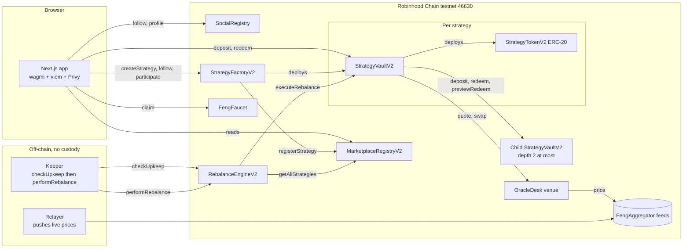

# Feng

**Turn what you believe into something others can discover and follow.** Feng is a social launchpad for tokenized investment strategies: write a thesis, back it with a weighted basket of tokenized stocks, publish it, and let other people follow it, participate in it, and track it. It runs on Robinhood Chain testnet (chain ID 46630, an Arbitrum L2).

Built for the Arbitrum Open House Singapore Online Buildathon.

| | |
|---|---|
| Network | Robinhood Chain testnet, chain ID 46630 |
| Live app | https://feng-thesis-launchpad.vercel.app and https://composable-strategy-marketplace.vercel.app |
| Source | https://github.com/Vamp-Labs/Feng |
| Contracts | Solidity 0.8.24, Foundry, OpenZeppelin v5. Deployed addresses in [Deployed addresses](#deployed-addresses) |
| Explorer | https://explorer.testnet.chain.robinhood.com |
| Docs | [PRD](PRD.md), [submission pack](docs/submission), [mainnet path](docs/research/15-mainnet-path.md) |
| License | MIT |

## The loop

```text
CREATE THESIS -> BUILD STRATEGY -> PUBLISH -> DISCOVER -> FOLLOW / PARTICIPATE -> TRACK
```

A creator believes AI infrastructure will define the next decade. They write that down, pick a basket of tokenized stocks (NVDA, AMD, TSMC, MSFT) and weights, and publish it as **AI Will Win ($AIWIN)**. Another user finds it on Explore, reads the thesis, checks the allocation, follows it, participates with test USDG, and tracks it from their portfolio. That one scenario is the whole product.

- **Explore** — the homepage: trending strategies, new strategies, categories (AI, Robotics, Space, Energy, Semiconductors, Technology).
- **Strategy Detail** — thesis, live allocation, creator, followers, and on-chain activity for one strategy.
- **Create** — a 5-step flow: name and ticker, thesis, pick stocks and weights, preview, publish.
- **Portfolio** — the strategies you follow and the ones you have participated in, strategy-first.
- **Creator Profile** — a handle, a bio, a follower count, and every strategy that creator has published.

Underneath the social layer, a strategy is still a real onchain primitive: an ERC-20 Strategy Token backed by a vault that holds real constituent value, prices everything live, and can rebalance back to target weights without anyone touching it.

## What is real versus mocked

Feng is a hackathon build on a testnet. This table says exactly what you can rely on and what you cannot.

| Area | Status | Detail |
|---|---|---|
| Chain | Real | Robinhood Chain testnet, chain ID 46630. Every contract below is deployed there and every demo transaction is an actual testnet transaction. |
| Smart contracts (V2) | Real, unaudited | `StrategyFactoryV2`, `StrategyVaultV2`, `StrategyTokenV2`, `MarketplaceRegistryV2`, `RebalanceEngineV2`, `SocialRegistry`, `OracleDeskV2`, `FengAggregator`, `FengFaucet`. 609 Foundry tests pass, including dedicated invariant and fuzz suites. An independent internal review found no open Critical or High severity issue. No third-party audit. |
| Social layer | Real | `SocialRegistry` holds follows (of a strategy or a creator) and creator profiles (handle, bio) on chain. Follower counts and "Following" in the Portfolio read live from it. |
| Wallets and login | Real | Privy embedded wallets (email or Google login) or an external wallet, through wagmi and viem. Gas is real testnet ETH. |
| Thesis and category | Real | The thesis is the on-chain strategy description (up to 160 bytes); the category is the first of up to three tags. Both are set at creation and shown on every card and the detail page. |
| Participate | Real, clearly labelled testnet | Participating deposits real testnet USDG into the strategy's vault and mints real Strategy Token shares. The UI labels every amount as testnet, not real money. |
| Composability | Real | Depth cap 2 is enforced on chain; a nested strategy's NAV reads its child's NAV live. Composability sits behind an "Advanced" disclosure rather than the main flow, per the current product focus on the social thesis loop. |
| Custody and settlement (V2) | Real | The vault holds constituent value through an `OracleDesk` venue with a fixed spread, values idle USDG in NAV, supports USDG and in-kind deposit and redeem, and enforces a per-vault slippage bound. Shares are minted on the measured value delta, not the nominal USDG in. |
| Marketplace | Real | Read straight from `MarketplaceRegistryV2` over RPC with a multicall batch. No indexer, no database. |
| Rebalancing | Real contract path, background process | `executeRebalance` is permissionless and triggers on a time interval or a weight-drift threshold. An ops relayer and keeper push live prices and call it; this is a background service, not something a user needs to think about day to day. |
| Prices | Real for the 5 original stocks and USDG, best-effort for 8 added stocks | A relayer pushes live quotes from Robinhood's public price API into role-gated `FengAggregator` feeds every few minutes. A handful of ticker symbols are not covered by that API and are refreshed manually between demos; `/api/ops/health` reports the live age of every feed. |
| Test funds for judges | Self-serve | `FengFaucet` and the `/start` page give a new wallet testnet ETH and mock USDG without asking anyone to run a script by hand. |
| Mainnet | Not deployed | The path is documented in [docs/research/15-mainnet-path.md](docs/research/15-mainnet-path.md), not built. |

An earlier version of this project (V1, no longer the live default) used a simpler vault that minted and burned mock stock tokens instead of valuing them through a venue, and its redeem path did not match its NAV. It is retired; see `docs/security/known-limitations.md` for the record.

## Architecture



| Contract | Role |
|---|---|
| `StrategyFactoryV2` | Validates constituents (no duplicates, weights sum to 10,000 bps, each weight at most the max weight, depth at most 2, nested child must be a registered leaf strategy), deploys the vault, registers it with its thesis and category. |
| `StrategyVaultV2` | Holds constituent value through the venue, mints and burns shares on the measured value delta, supports USDG and in-kind deposit and redeem, checks price freshness, rebalances on interval or threshold with a bounded slippage check. |
| `StrategyTokenV2` | Plain ERC-20 whose mint and burn are restricted to its vault. |
| `MarketplaceRegistryV2` | Strategy list with token, creator, depth, creation time, thesis description and tags. |
| `SocialRegistry` | Follows of a strategy or a creator, follower counts, and creator profiles (handle, bio). |
| `RebalanceEngineV2` | Permissionless entry point: `checkUpkeep()` lists vaults needing work, `performRebalance(vault)` triggers one. |
| `OracleDeskV2` | The execution venue: quotes and fills each constituent leg at a fixed spread over the oracle price. |
| `FengAggregator` | Role-gated Chainlink-shaped price feed, written to by the relayer. |
| `FengFaucet` | Self-serve testnet ETH and mock USDG for a new wallet. |

Frontend routes: `/` (Explore), `/strategy/<vault>` (Strategy Detail), `/create`, `/positions` (Portfolio), `/creator/<address>` (Creator Profile), `/start` (get test funds), `/leaderboard`, plus `/marketplace` for the full strategy list.

## User flows

**Create.** Open `/create`: name the strategy and its ticker, write the thesis, pick stocks and set weights until they total 100 percent, pick a category, preview the result, and publish. The factory deploys the vault and token and registers the thesis and category; the app opens the new strategy page.

**Discover and follow.** Explore lists trending and new strategies by category. Opening one shows the thesis, the live allocation, the creator, and recent activity. Following costs a small transaction and updates the follower count for everyone.

**Participate.** On a strategy page, enter a testnet USDG amount and confirm. The vault checks that every price feed is fresh, mints strategy shares, and acquires each constituent through the venue. The UI is explicit that this is a testnet transaction, not real money.

**Track.** `/positions` shows every strategy you have participated in (amount, allocation, a link back to the strategy) and a Following tab for strategies you follow without having participated yet.

**Rebalance (background).** The keeper polls `checkUpkeep()` and calls `performRebalance(vault)` for each strategy whose interval has elapsed or whose weights have drifted past the configured band. This happens automatically; the demo does not require a user to trigger it.

**Compose (advanced).** A published strategy's token can be used as a constituent of a new strategy, up to depth 2. This sits behind an "Advanced" disclosure rather than the main create flow, since the current product focus is the thesis and social loop, not portfolio-of-portfolios.

## Deployed addresses (V2, Robinhood Chain testnet)

Source: `deployments/robinhood-testnet-v2/addresses.json`.

#### Core contracts

| Contract | Address |
|---|---|
| Marketplace registry | [`0x372D697F49e9a568aa2090cE52b71Fc90ba48567`](https://explorer.testnet.chain.robinhood.com/address/0x372D697F49e9a568aa2090cE52b71Fc90ba48567) |
| Social registry | [`0xe0FaeeD02db34f98Da05bab08E01a1473f8dC6F1`](https://explorer.testnet.chain.robinhood.com/address/0xe0FaeeD02db34f98Da05bab08E01a1473f8dC6F1) |
| Strategy factory | [`0x26E9d4D2A0eE38eD5596f05f6997840a8d4F68Ee`](https://explorer.testnet.chain.robinhood.com/address/0x26E9d4D2A0eE38eD5596f05f6997840a8d4F68Ee) |
| Rebalance engine | [`0x29d45b61Ee0b2f5aeC57Fa31fC8c3dbD0FC45EfF`](https://explorer.testnet.chain.robinhood.com/address/0x29d45b61Ee0b2f5aeC57Fa31fC8c3dbD0FC45EfF) |
| Oracle desk (venue) | [`0x498E5e189D57142760eBd4cFE69F75116e8F45C8`](https://explorer.testnet.chain.robinhood.com/address/0x498E5e189D57142760eBd4cFE69F75116e8F45C8) |
| Vault deployer | [`0x19f0BbAD896AEC750c6425346197f006908e6390`](https://explorer.testnet.chain.robinhood.com/address/0x19f0BbAD896AEC750c6425346197f006908e6390) |
| Strategy lens | [`0xaF26400E815b9A1f441123cEdf633C4b05e9D4da`](https://explorer.testnet.chain.robinhood.com/address/0xaF26400E815b9A1f441123cEdf633C4b05e9D4da) |
| Faucet | [`0x923c01163499726578e1871B80Ca5468Fd1955ac`](https://explorer.testnet.chain.robinhood.com/address/0x923c01163499726578e1871B80Ca5468Fd1955ac) |

#### USDG

Mock USDG, 6 decimals (matching Paxos' real USDG on this testnet): [`0x812eCDfabbEdcD0A363feb3b4Ef6B75Cba644CbF`](https://explorer.testnet.chain.robinhood.com/address/0x812eCDfabbEdcD0A363feb3b4Ef6B75Cba644CbF)

#### Stock tokens and price feeds

13 tickers: TSLA, AMZN, NFLX, PLTR, AMD, NVDA, TSMC, MSFT, GOOGL, RKLB, ISRG, XOM, ENPH. Full addresses are in `deployments/robinhood-testnet-v2/addresses.json` under `stockTokens` and `priceOracles`.

#### Published strategies

12 thesis strategies seeded across 4 creator wallets.

| Symbol | Name |
|---|---|
| AIWIN | AI Will Win |
| CHIPS | Semiconductor Boom |
| CLOUD | Cloud Titans |
| ROBOT | Robotics Future |
| ORBIT | Space Race |
| COSMOS | Deep Space Capital |
| GREEN | Clean Energy Shift |
| BARBL | Energy Barbell |
| VOLT | Grid Future |
| SUPER | Chip Supercycle |
| BIGT | Big Tech Core |
| ANDRO | Humanoid Robotics |

Full vault and token addresses are in `deployments/robinhood-testnet-v2/addresses.json` under `vaults`, or readable live from `MarketplaceRegistryV2.getAllStrategies()`.

## Running locally

```bash
pnpm install
cp .env.example .env.local   # set NEXT_PUBLIC_PRIVY_APP_ID and the network vars
pnpm dev
```

Contracts: `forge test` (Foundry). Deploy and seed scripts live in `script/`; operational scripts (keeper, price refresh, test-fund faucet) live in `scripts/`.

## Known limitations

- A handful of stock tickers are not covered by the relayer's free price source and are refreshed manually between demos rather than continuously; see `/api/ops/health` for live feed ages.
- No third-party security audit; see `docs/security/known-limitations.md` and `docs/security/threat-model.md` for the internal review.
- The retired V1 vault (not the live default) had a known accounting gap between its redeem path and its NAV; it is documented, not in use.
- Mainnet deployment is designed, not built (see `docs/research/15-mainnet-path.md`).
