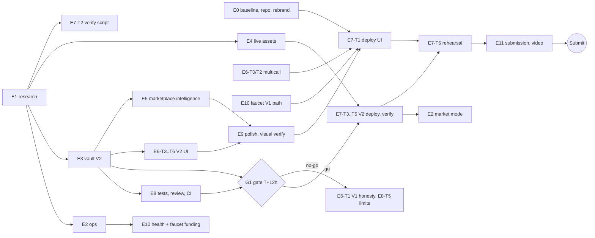

# Feng v2 plan: settlement-correct vaults, always-on ops, real-asset path, judge-ready demo and submission

- **Date**: 2026-10-03 · **Project**: Feng (repo `/home/cn/Projects/Competition/Web3/Arbitrum/Feng.`, the directory name ends with a dot) · **Mode**: smart contract / web3, feature ideas, code task, product
- **Status**: draft (decisions unconfirmed). The user has not said "yes". Nothing in this plan has been built. One research file was written while planning: `docs/research/07-testnet-reality-check.md`.

## 0. Read this first

**Deadline.** HackQuest submission closes **2026-10-04 23:59 SGT**. Planning time is about 2026-10-03 22:00 SGT, so roughly 26 hours remain. The user said to ignore time when planning, so no scope is cut. Every task carries a priority and an effort estimate in agent-hours. `P0` = needed for a credible, honest, working submission. `P1` = high value, start now in parallel, ship only if it passes its gate. `P2` = nice to have.

**Five things I found while reading the code and the chain that change the plan** (evidence in `docs/research/07-testnet-reality-check.md`):

1. **The V1 vault has an accounting hole.** `StrategyVault.deposit` keeps the deposited USDG as idle cash AND mints mock stock tokens; `_totalAssetsUSDG` counts only the stock tokens; `redeem` pays `usdgToken.balanceOf(vault) * shares / supply` (`StrategyVault.sol:116`). So after any price move, `previewRedeem` (NAV based) and the real payout disagree, early holders over-draw the cash pot, and a price rise makes the vault insolvent in USDG. No test covers "price moves, then redeem" (`contracts/test/StrategyVault.t.sol`). Judges score "smart contract quality" first.
2. **Real assets exist on the testnet after all.** The five faucet stock tokens (TSLA `0xC9f9...3bd4E`, AMZN, AMD, PLTR, NFLX) and **Paxos' USDG `0x7E955252E15c84f5768B83c41a71F9eba181802F` (6 decimals)** are on chain. The earlier "none exist" conclusion (DEMO-NOTES section 7) was wrong. V1 cannot use them: real stock tokens cannot be minted by us, and real USDG has 6 decimals while V1 assumes 18 (`StrategyVault.sol:96`, `src/lib/format.ts:3`). The hackathon gives explicit extra consideration to projects integrating Paxos USDG.
3. **Live prices are available for free.** `https://api.robinhood.com/rhj/prices/{symbol}` returns real bid/ask. Our seeded mock prices (TSLA 250, PLTR 25, NFLX 600) are far from reality (TSLA 371, PLTR 188, NFLX 67). A relayer pushing real prices makes performance, threshold rebalances and oracle freshness real.
4. **The live site is stale and not judge-usable.** `https://composable-strategy-marketplace.vercel.app/marketplace` returns 404 (the redesign was never deployed); the title still says "Composable Strategy Marketplace" and the footer "StrategyMarket"; `README.md` is the create-next-app default; the repo is not a git repository (the HackQuest form asks for a GitHub link); a new judge wallet has no ETH and no USDG (`scripts/fund.sh` is manual); the contracts are not verified on the explorer; the keeper dies when the laptop sleeps.
5. **Operational constants.** Gas is about 0.01 gwei (creating a vault cost 0.0000276 ETH), so the deployer's 0.0082 ETH is enough for a full redeploy plus weeks of ops. Historical `eth_call` state is not retained (fails 100k blocks back), but `eth_getLogs` works over 50M blocks, so event-sourced history is viable. Multicall3 exists at `0xcA11bde05977b3631167028862bE2a173976CA11` but `src/lib/chains.ts` does not use it.

**Biggest process risk to resolve in the first hour:** the HackQuest form's own `registrationClose` is 2026-10-02T17:01Z (2026-10-03 01:01 SGT), already past (`docs/handoffs/DEMO-NOTES.md` section 6). Confirm the team is registered (E0-T5, Open question 1).

**Recommended shape in one paragraph.** Run two tracks in parallel from minute zero. Track A (P0) makes the *existing* V1 deployment honest, reachable and always-on: deploy the redesigned UI, rebrand, verify contracts, run an always-on keeper plus price heartbeat, add a self-serve test-funds faucet, README and demo. Track B (P1, gated) builds **Vault V2** (venue-based custody, correct NAV, in-kind deposit/redeem, slippage protection, USDG decimals, bounded price feed, NAV checkpoints), then redeploys and reseeds. If V2 passes its gate at T+12h it becomes production and the real-price relayer plus the Paxos-USDG "Live" universe switch on; if not, V1 ships with a candid "known limitations" section. Both tracks share the same ops layer, frontend and submission package.

### How to use this document

- Each epic in section 6 is self-contained: paste the **Common preamble** (below) plus that epic's block to its agent.
- Section 7 lists every research task with exact questions and output paths.
- Section 8 freezes the interfaces between lanes (ABI sketches, JSON shapes) so lanes can run in parallel.
- Section 9 gives the dependency graph, the order and the gates.
- IDs: `E<epic>-T<task>`; research tasks are `R1..R8` and also appear inside E1 and E4.

### Common preamble (prepend to every agent prompt)

```
Repo: /home/cn/Projects/Competition/Web3/Arbitrum/Feng. (name ends with a dot; always quote paths).
Product name is "Feng". Read AGENTS.md first: this is Next.js 16.3.6 with breaking changes; before using any
Next API read the matching guide under node_modules/next/dist/docs/01-app/ (for example
03-api-reference/03-file-conventions/route.md, 02-route-segment-config/maxDuration.md, preferredRegion.md).
Standing decisions (do not relitigate): Robinhood Chain testnet (chain 46630) only; Privy for wallets;
framer-motion + lenis for motion; deposits and redeems in USDG; composability depth cap 2; permissionless keeper;
keys only through environment variables, never written to a tracked file, never printed (names used here:
DEPLOYER_PRIVATE_KEY, KEEPER_PRIVATE_KEY, RELAYER_PRIVATE_KEY, FAUCET_PRIVATE_KEY, CRON_SECRET); never read or echo
.env* files; do not delete the user's other Railway or Vercel projects.
Network: the user's ISP intercepts TLS to rpc.testnet.chain.robinhood.com intermittently. Retry every cast/forge/curl
call. For forge script use --broadcast --slow and on failure --resume; never rerun a broadcast from scratch.
Docs hosts (docs.robinhood.com, docs.paxos.com) need curl --resolve with the real IP from DoH (1.1.1.1/dns-query).
Style: pnpm, TypeScript strict, Solidity 0.8.24 evm paris OpenZeppelin v5, no code comments except // TEMPORARY, no
new dependency without naming it in your report. Stay inside your lane (ownership map in section 8.4); if you need a
change elsewhere, list it under "Requests" in your report.
Report: files changed, commands run with results, acceptance checklist ticked or failed with reason, open risks.
```

## 1. Context (what exists, with evidence)

Verified by reading the code on 2026-10-03; trust the code over any summary.

- **Contracts** (`contracts/`, Foundry, Solidity 0.8.24, evm paris, OZ v5; 48 tests per the user and `docs/handoffs/STATUS.md`): `StrategyFactory` (`MAX_DEPTH = 2`, nested child must be a depth-1 leaf, duplicate and unknown-token checks, grants `MINTER_ROLE` on every non-strategy constituent so it only works with our mocks), `StrategyVault` (custom, USDG only, virtual-shares inflation guard `DECIMALS_OFFSET = 3`, time and per-asset threshold rebalance, 24 h staleness on deposit, redeem and rebalance), `StrategyToken`, `MarketplaceRegistry` (vault, token, creator, depth, createdAt only), `RebalanceEngine` (`checkUpkeep`, `performRebalance`, no events), `ChainlinkPriceOracle` (per-token `AggregatorV3Interface` adapter), `MockV3Aggregator` (**open** `updateAnswer`), `MockUSDG` (18 decimals, owner mint), `MockStockToken` (`MINTER_ROLE`, `uiMultiplier`).
- **Deployed** on chain 46630 (`deployments/robinhood-testnet/addresses.json`): mocks, one oracle, factory `0xB0C8...1087`, engine `0x2e33...1226`, registry `0x9A4A...ACa`, and 10 seeded strategies (`script/SeedStrategies.s.sol`): AIGR, STRM, EVMO, EQ5, DEFC, CHIP, BLTZ, CLCM and depth-2 CORE (AIGR 40, EQ5 40, TSLA 20) and CONV (STRM 40, CHIP 30, PLTR 30). Not verified on the explorer. Vault NAV example: AIGR vault `0x9f61...B243B` NAV 6,489.6 USDG on 2026-10-03.
- **Ops**: `scripts/keeper.sh` (bash + cast loop, 30 s) on the laptop; `scripts/refresh-feeds.sh` pushes **constant** prices (260, 183, 581, 26, 138) every time; both stop when the laptop sleeps. `scripts/deploy.sh`, `seed.sh`, `fund.sh` exist (retry wrappers). `deploy.sh` verifies only factory, engine, registry.
- **Frontend** (`src/`): Next.js 16.3.6 App Router, React 19, wagmi 3 + Privy. Routes: `/`, `/marketplace`, `/create`, `/positions`, `/strategy/[vault]`. No `/api` routes, no `/leaderboard`. `use-marketplace.ts` reads registry plus NAV per vault; `StrategyDetail` shows NAV and constituents; `DepositRedeemPanel` is USDG only with `USDG_DECIMALS = 18`. The marketplace/hero redesign and the create-page "token-picker composer" (chip picker with `aria-pressed`, `MAX_CONSTITUENTS = 6`) exist in the repo; the live Vercel build lacks `/marketplace`. Design drift versus the Afterglow spec is documented in `docs/brainstorm/2026-10-01-...md`; the code currently loads Poppins (`src/app/layout.tsx`), not the Inter the drift note describes, so re-measure before acting.
- **Docs**: `docs/handoffs/STATUS.md` and `DEMO-NOTES.md` describe the 2026-09-28 local-anvil state, not the live testnet deployment. `docs/handoffs/contracts.md` section "MVP asset-acquisition simplification" binds the mint/burn model and says "all amounts 18 decimals". `README.md` is the framework default. `PRD.md` and `docs/prd.md` hold the product requirements.
- **Constraints**: ISP TLS interception to the RPC; deployer ETH about 0.0082; faucets are CAPTCHA gated (ETH comes only from the deployer); Privy allowed-origins must include every new domain or port; Railway free plan blocked (user may switch accounts).

## 2. The question

The user wants the next update of Feng planned as agent-assignable work: what the PRD features still need, the technically best way to deliver them (not the PRD's technical sections), research where it is deep, and a build order that works under a one-day deadline.

## 3. Gap analysis: PRD features versus the current code

Status: **done** / **partial** / **missing** / **mocked** (works only because the market is our own mock).

### 3.1 Must Have (PRD 6.1)

| PRD feature | Status | Evidence | Closed by |
|---|---|---|---|
| Create strategy: pick stocks, weights, rules (interval, max weight) | **done** with gaps | `src/components/create-strategy-form.tsx` composer, validation in `StrategyFactory.createStrategy`. Gaps: factory accepts any address as a constituent (no oracle or venue check; the `grantRole` call makes real tokens revert); no description or tags | E3-T4, E6-T6 |
| Tokenize: ERC-20 Strategy Token + vault holding assets | **done** | `StrategyToken.sol`, `StrategyVault.sol`; 10 seeded vaults on chain | none |
| Deposit assets, receive Strategy Token | **partial, mocked** | USDG only (`deposit(usdgAmount, receiver)`); no deposit of underlying tokens; 18-decimal mock USDG assumed (`StrategyVault.sol:96`); vault mints its own constituents | E3-T3, E6-T3 |
| Redeem Strategy Token, receive underlying pro rata | **partial, wrong accounting** | Pays cash-pot share, not NAV (`StrategyVault.sol:116`); preview mismatch; no in-kind redeem except nested units | E3-T3 |
| Auto-rebalance, time based | **done in code, mocked execution** | `_rebalanceNeeded` L243; execution mints and burns mocks (`_rebalanceConstituent`); keeper laptop-only | E2, E3-T3 |
| Auto-rebalance, threshold (asset above max weight) | **done in code, never fires in practice** | `weightBps > maxWeightBps` L251, unit test `test_thresholdBasedRebalance_multiAssetSkew`; but feeds are static (`scripts/refresh-feeds.sh` pushes constants) | E2-T1 market mode |
| Composability: Strategy Token inside a strategy | **done** | `StrategyFactory` depth and leaf checks, live nested NAV, tests `DepthCycle.t.sol`, seeded CORE and CONV | none (E3 preserves) |
| Marketplace: public list | **done in repo, not deployed** | `src/app/marketplace/page.tsx`; live `/marketplace` is 404 | E7-T1 |
| Marketplace: basic performance (price change) | **missing** | Cards show NAV only (`use-marketplace.ts`); no share price, no history; no historical state on the RPC | E5-T1, E3-T3 (`sharePrice`, `NavCheckpoint`) |
| Marketplace: one-click mint / follow | **partial / missing** | Mint is two clicks via the detail page; no follow or watchlist | E5-T2 |
| USDG support | **mocked** | `MockUSDG` 18 decimals. Real Paxos USDG exists (6 decimals), unusable by V1 | E3, E4 |

### 3.2 Nice to Have (PRD 6.1) and Future Scope (PRD 6.2)

| Feature | Status | Evidence / plan | Priority |
|---|---|---|---|
| Creator performance leaderboard | missing | computed client-side from marketplace data, E5-T5 | P2 |
| Simple reputation score | missing | formula in E5-T5, shown on leaderboard | P2 |
| Description + tags | missing | on-chain metadata in the registry, E3-T4, E5-T4 | P1 |
| Advanced rule engine (volatility, drawdown, conditions) | missing | out of scope; a "what-if" simulator for the existing two rules is E6-T8 | P2 |
| Strategy Token as collateral | missing | out of scope; note that an Aave fork ("Edel") exists on testnet (07, section 2.1) for the roadmap | none |
| Social / copy-trading | missing | watchlist only (E5-T2) | P1 |
| Creator fee sharing | missing | optional management fee, E3-T8 | P2 |
| Multi-asset beyond stocks | partial | any ERC-20 with a feed and venue support becomes eligible in V2 | via E3 |
| Governance | missing | out of scope | none |

### 3.3 Technical requirements and success metrics (PRD 4, 8)

| Item | Status | Evidence | Closed by |
|---|---|---|---|
| Slippage protection | **missing** | no `minShares`, no `minOut`, no venue | E3-T3 |
| Accurate NAV | **partial** | oracle based; cash omitted from NAV; 24 h staleness; no weekend handling for real feeds | E3-T3, mainnet-path doc |
| Gas-efficient rebalancing | partial | O(n) per vault, `checkUpkeep` loops all vaults; fine at 10 vaults | E3 gas report |
| Nested depth limit | done | MAX_DEPTH 2 | none |
| Live deployment | done, unverified | addresses.json; explorer shows unverified contracts | E7-T2 |
| End-to-end demo under 3 minutes | not rehearsed on testnet | DEMO-NOTES is anvil only | E7-T6, E11-T4 |
| USDG integration | mocked | see above | E3, E4 |
| Differentiated feature (rules + composability) | done | seeded CORE and CONV | none |

### 3.4 Not in the PRD but required for a credible submission

| Item | Status | Closed by |
|---|---|---|
| Oracle freshness automation (24 h cliff) | manual script | E2 |
| Always-on keeper | laptop | E2 |
| Explorer verification | none | E7-T2, E7-T4 |
| README, architecture, demo script, video, submission answers | README is the framework default | E11 |
| GitHub repository | not a git repo | E0-T2 |
| Judge onboarding (test ETH and USDG) | manual `fund.sh` | E10 |
| Brand "Feng" in the UI | footer says StrategyMarket; title says Composable Strategy Marketplace | E0-T3 |
| CI | none | E8-T4 |
| Multicall batching and RPC resilience | not configured | E6-T2 |

## 4. Decision

Recommended, not yet confirmed. Deviations from the PRD or the current code carry a one or two line justification.

| # | Decision | Why / deviation |
|---|---|---|
| D1 | **Vault V2 replaces mint/burn + cash pot with venue-based custody.** The vault holds real constituent tokens, buys and sells them through an immutable `IVenue`, and values everything (including idle USDG) in NAV. | Deviates from `docs/handoffs/contracts.md` "MVP asset-acquisition simplification". Reason: it is the only fix that makes redeem equal NAV, lets the vault hold tokens it cannot mint (real Stock tokens), and removes the USDG-solvency hole. |
| D2 | **Execution venue abstraction, shipped first with a mock market maker (`OracleDesk`)**, later optionally a Uniswap v4 adapter. | Direct DEX integration is rejected for now: v4 needs unlock/callback plumbing, pool depth is unverified, and a deterministic demo needs deterministic fills. Same interface lets the real venue slot in later. |
| D3 | **Add in-kind deposit and in-kind redeem; in-kind redeem needs no oracle and no venue.** | Delivers the PRD wording "deposit underlying assets" and "redeem pro rata into underlying", and gives users an exit when feeds are stale or the venue is empty (also the lesson from the Stream Finance collapse in `docs/research/03-domain.md`). |
| D4 | **Slippage protection**: `minShares` on deposit, `minUsdgOut` on redeem, per-leg bounds against the oracle with a per-vault `maxSlippageBps` (cap 500). | PRD section 8 lists it; V1 has none. |
| D5 | **Mint shares on the measured value delta, not the nominal USDG**, so venue spread is paid by the depositor, not existing holders. | Standard fix for swap-in deposits; V1 had no spread so never needed it. |
| D6 | **USDG decimals are read, not assumed**; the mock becomes 6 decimals like Paxos' USDG. | Deviates from "all amounts 18 decimals" in `contracts.md`. Exercises the decimal path now so the real token works. |
| D7 | **Replace the open `MockV3Aggregator.updateAnswer` with a role-gated, deviation-bounded `FengAggregator`**, fed by a relayer from Robinhood's live price API. Keep `ChainlinkPriceOracle` unchanged as the mainnet path. | Anyone can currently set any price (it is a mock, but it reads as a vulnerability). Chainlink has no testnet feeds (07, section 2.3). |
| D8 | **Performance history is event-sourced**: vault emits `NavCheckpoint(totalAssets, totalSupply)` on every deposit, redeem, rebalance and a permissionless hourly `checkpoint`; the frontend reads it with chunked `getLogs`. No subgraph, no database. | RPC keeps no historical state (07, section 2.4); logs work over huge ranges. Matches the earlier "no indexer" decision. Since-inception return needs no history (inception price is a constant). |
| D9 | **Follow = client-side watchlist first.** On-chain follow only if time remains. | PRD lists "follow" next to "mint"; a zero-transaction star is instant and sufficient for the MVP. On-chain social is PRD future scope. |
| D10 | **Ops = one runtime-agnostic TypeScript core with two shells**: a Next route handler for a pinger or cron, and a loop worker for Railway or any VM. Health is computed live from chain reads, no storage. | Hedges the unresolved hosting question (Railway blocked) with one codebase; keeps keys server-side; one place to fix TLS retries. |
| D11 | **Two universes behind one code path**: Sandbox (our mintable mocks, 6-decimal mock USDG) as the reliable default, and Live (real faucet stock tokens + Paxos USDG) via a second factory and desk. | Real tokens give the USDG bonus and a strong story, but real USDG is faucet-limited and CAPTCHA gated, so it cannot be the only path. |
| D12 | **Gate G1** decides V2 versus V1 at T+12h; V1 stays deployed and kept fresh until the final decision; rollback is Vercel "promote previous deployment". | A one-day budget cannot absorb a failed redeploy without a fallback. |
| D13 | **Kept from before**: Foundry, custom vault (not literal ERC-4626), depth 2, USDG as primary asset, permissionless keeper, on-chain registry read by RPC, Privy. | Still the right call. |
| D14 | **Design tokens: codify the current site tokens as canonical (docs only)**; a realignment to the Afterglow spec is a separate P2 pass. | The user already decided touched cards follow current tokens; chasing a spec nobody follows costs hours. |

## 5. Options considered

### 5.1 Settlement model (the central decision)

| | O1 keep V1, document the limit | O2 patch V1 (cash and NAV only) | **O3 V2 venue custody (chosen)** | O4 V2 with Uniswap v4 only |
|---|---|---|---|---|
| Fixes redeem != NAV | no | partly, still insolvent on price rise (needs a funded counterparty anyway) | **yes** | yes |
| Holds real Stock tokens | no | no | **yes** | yes |
| Works with Paxos USDG (6 dec) | no | no | **yes** | yes |
| Deterministic demo | yes | yes | **yes (mock desk)** | no (liquidity unknown) |
| Effort (agent hours) | 0 | 6 | **about 23 plus 8 tests and review** | about 30 |
| Risk | judged on quality | half fix | schedule, covered by G1 | thin pools, plumbing |
| Reversibility | n/a | n/a | V1 stays deployed | low |

Pick O3. Condition that would change it: if G1 fails, ship O1 with an honest "Known limitations" and keep O3 as the documented roadmap.

### 5.2 Keeper and relayer host

| Option | Always on | Outside Indonesia | Cost and effort | Notes |
|---|---|---|---|---|
| Laptop systemd | no (sleeps) | no | 0 | fallback only |
| **Vercel route + external pinger** | yes | yes | low; needs `CRON_SECRET`, a pinger (for example cron-job.org) | reuses the existing Vercel project; Hobby Vercel Cron is daily only, assumption to verify in R5, so use it as a backstop |
| Railway worker | yes | yes | needs the user's new Railway account | free-plan limit blocked the last attempt |
| GitHub Actions schedule | roughly (5 to 15 min jitter) | yes | needs the GitHub repo | enough for a 30 min cadence, weak for the 1 h BLTZ strategy |
| Cloudflare Worker cron | yes | yes | new account | good but a third platform |

Default: build the core once, ship **both** shells (route and worker), deploy the route behind a pinger first and use the worker wherever an account is available. R5 confirms.

### 5.3 History and performance data

| Option | Verdict |
|---|---|
| **On-chain `NavCheckpoint` events + `getLogs`** | chosen: no infra, auditable, proven by the 50M-block log test |
| Off-chain store (KV or Postgres) filled by the ops tick | rejected: new service, new trust, extra secret |
| Subgraph | rejected: no indexer decision stands |
| Archive `eth_call` | impossible (state not retained) |

### 5.4 Follow, real-asset universe

Follow: client watchlist (chosen) versus on-chain `FollowRegistry` (P2 on top). Universe: Sandbox only (safe, weaker USDG story), Live only (fragile), **Sandbox default + Live addition (chosen)**.

### 5.5 Pre-mortem (it is 2026-10-05 and this failed; why?)

| Failure | Mitigation in this plan |
|---|---|
| V2 slipped and we shipped nothing new | tracks are independent; P0 path never depends on V2; G1 at T+12h |
| Keeper wallet ran out of ETH or the price push stopped, so every deposit reverted with `StalePrice` | heartbeat push every 30 min, 12 h hard floor, health badge, alerting field in `/api/ops/health`, `redeemInKind` works with stale feeds |
| Judges could not try it (no gas, no USDG, wallet network) | E10 faucet, network add helper, guided steps |
| Demo video recorded on the filtered network and the RPC flaked | record via VPN or phone hotspot (E11-T6), rehearsal E7-T6 |
| Paxos faucet CAPTCHA or tiny claims blocked the Live universe | Live is additive (E4 gated), Sandbox is the default |
| Registration closed and we cannot submit | E0-T5 and R7 in the first hour |
| Two agents edited the same files | lane ownership map (8.4) |
| Reviewer reads mocks as dishonest | README "real versus mocked" table, E11-T2 |

### 5.6 Red team on the recommendation (run solo, the voices could not be spawned)

- *"Redeploying everything the night before is reckless."* True, hence G1 and V1 staying live; V2 only replaces V1 if tests, the independent review and a dry run pass.
- *"A mock desk that mints stock is still a simulation."* Yes, but now the simulation is at the market boundary (an `IVenue` with spread, slippage and a finite reserve), the vault code is production-shaped, and the Live universe uses real tokens. The README says so plainly.
- *"The price relayer centralises trust."* On testnet there is no live Chainlink feed (confirmed 404), so a role-gated, deviation-bounded relayer is the honest stand-in, and the oracle adapter keeps Chainlink as a config change.

## 6. Epics

Totals in agent-hours. Lanes: **A** contracts, **B** ops, **C** frontend, **D** research, **E** docs and submission. Every block lists owner, tasks, INPUT, OUTPUT, CONNECTIONS, acceptance and main risk.

### E0. Baseline, repo hygiene, rebrand (P0, 5.2h)

**Goal / outcome**: know the true state, make the repo publishable and safe, and show the name "Feng" everywhere a judge looks. Serves: submission readiness (GitHub link required by the form).

**Owner / skills**: `general-purpose` for T1, T2; `work:frontend` for T3 (skills `work:reuse-first`, `work:nextjs-app-router`); `hackathon-pm` for T4; the user for T5.

| ID | Type | Task | h | Pri |
|---|---|---|---|---|
| E0-T1 | verify | Run `forge test`, `pnpm lint`, `pnpm build` (set `NEXT_PUBLIC_PRIVY_APP_ID` to a dummy for the build), read the 10 vaults on chain (name, NAV, depth, `lastRebalanceTimestamp`, `rebalanceNeeded`), read each feed's `updatedAt`, ETH balances of deployer and keeper, smoke the live site routes. Write the result. | 1.5 | P0 |
| E0-T2 | build | Repo hygiene: confirm `.gitignore` covers `.env*`, `broadcast/`, `cache/`, `out/`, `dev/fixture/{out,cache,broadcast}`; scan the tree for 64-hex private keys; add `LICENSE` (MIT); `git init`; stage nothing without the user's yes; prepare the GitHub remote command. Pushing needs the user. | 1 | P0 |
| E0-T3 | build | Rebrand to Feng: `src/app/layout.tsx` metadata, `site-footer.tsx` text, wordmark, `package.json` name, OG tags. Keep the Vercel project id and URL. | 1.5 | P0 |
| E0-T4 | build | Replace the stale `docs/handoffs/STATUS.md` with the current state; mark `contracts.md` simplification as "superseded by V2 once G1 passes". | 1 | P1 |
| E0-T5 | verify | **User**: confirm HackQuest registration for the team and that submission still opens (form says registration closed 2026-10-03 01:01 SGT). | 0.2 | P0 |

**INPUT**: repo; `.gitignore`; `docs/handoffs/DEMO-NOTES.md` section 6; live URL https://composable-strategy-marketplace.vercel.app.
**OUTPUT**: `docs/handoffs/BASELINE-2026-10-03.md` (command results, per-vault table, feed ages, balances, route status); `LICENSE`; initialised git repo; renamed strings; refreshed `STATUS.md`.
**CONNECTIONS**: BASELINE feeds E2 (vault list, keeper balance), E7 (smoke list), E8 (what already passes). The secret-free repo gates E7-T1 CI and E11. Needs from the user: T5 answer, push approval.
**Acceptance**: BASELINE shows forge 48/48 or the exact failures; `rg -n "StrategyMarket|Composable Strategy Marketplace" src` is empty; no `.env*` or 64-hex key staged; `git status` clean of artifacts.
**Main risk**: `pnpm build` fails because the redesign was never built; then T1 lists the fixes for E7-T1.

### E1. Research sprint (P0 for gates, 13.5h across parallel agents)

**Goal**: answer every deep technical question once, in files, before code depends on them. Owner: five parallel `general-purpose` research agents (WebSearch, WebFetch, curl, Blockscout REST). Details of every question are in section 7.

| ID | Research | Output file | h | Pri | Gates |
|---|---|---|---|---|---|
| E1-T1 (R1) | Real assets and Paxos USDG deep dive | `docs/research/08-real-assets-and-usdg.md` | 2 | P1 | E4 |
| E1-T2 (R2) | Price source and feed design | `docs/research/09-price-source-and-feed.md` | 2 | P0 | E2-T1, E3-T1 |
| E1-T3 (R3) | Venue design: OracleDesk versus Uniswap v4 | `docs/research/10-venue-design.md` | 2.5 | P1 | E3-T2, E4-T5 |
| E1-T4 (R4) | Blockscout verification of factory-made contracts | `docs/research/11-blockscout-verification.md` | 1.5 | P0 | E7-T2 |
| E1-T5 (R5) | Always-on hosting for ops | `docs/research/12-always-on-hosting.md` | 1.5 | P0 | E2-T4 |
| E1-T6 (R6) | Gas sponsorship and account abstraction for judges | `docs/research/13-gas-sponsorship.md` | 1.5 | P2 | E10 |
| E1-T7 (R7) | HackQuest submission rules re-check | `docs/research/14-hackquest-submission.md` | 1 | P0 | E11 |
| E1-T8 (R8) | Real Chainlink and mainnet path facts | `docs/research/15-mainnet-path.md` | 1.5 | P2 | E11-T2 |

**INPUT**: `docs/research/07-testnet-reality-check.md` (the baseline facts and reproduce commands), `docs/research/02-robinhood-testnet.md` (superseded where 07 disagrees), this plan's section 7.
**OUTPUT**: the files above, each ending with "Recommendation" and "Still unknown".
**CONNECTIONS**: R2 and R5 unblock lane B; R4 unblocks E7; R1 and R3 shape lane A and E4; R7 shapes E11. Hands recommendations to the lane owners by file path, not chat.
**Acceptance**: each file answers every listed question with a URL or a command output and a date, states a recommendation, and lists what is still unknown.
**Main risk**: CAPTCHA and ISP filtering block fetches; use `curl --resolve` and the Blockscout REST API (both proven in 07).

### E2. Always-on ops: price relayer, keeper, health (P0, 11.5h)

**Goal / outcome**: prices never go stale, rebalances happen without the laptop, and a public health endpoint proves it. Serves: PRD "auto-rebalancing" in practice, "threshold rebalance", and demo reliability.

**Owner / skills**: `general-purpose` (instance `GP/ops`) loading `vercel:vercel-functions`, `vercel:env-vars`, `vercel:vercel-cli`, and `use-railway` if a Railway account is available; `work:frontend` for T7.

| ID | Type | Task | h | Pri |
|---|---|---|---|---|
| E2-T1 | build | `src/ops/prices.ts` and `src/ops/relayer.ts`: fetch Robinhood prices (use `tokenBid` and `tokenAsk`, take the mid, scale to the feed's 8 decimals), push `updateAnswer` when the move is at least 10 bps or the last push is older than 30 min. Modes: `hold` (re-publish the last on-chain answer to keep it fresh; used for V1) and `market` (live prices; used for V2). Skip on `isTradingHalt` or a failed fetch but never let a feed age past 12 h. Retry with backoff on TLS errors. Multi-deployment: takes a list of deployments so V1 and V2 can both be kept fresh. | 3 | P0 |
| E2-T2 | build | `src/ops/keeper.ts`: read `checkUpkeep`, `simulateContract` then `performRebalance` per vault with per-vault error isolation; on `StalePrice` run the relayer first and retry once; refuse to send when the keeper balance is below a floor and report it; after V2, call `checkpoint` hourly. | 2 | P0 |
| E2-T3 | build | Entrypoints: `src/app/api/ops/tick/route.ts` (GET and POST, requires `Authorization: Bearer ${CRON_SECRET}`, sets `maxDuration`, runs relayer then keeper then optional checkpoint, returns a JSON summary), `src/app/api/ops/health/route.ts` (public, read-only, computed from chain), `scripts/ops-worker.ts` (loop, same core). Read the Next route docs first. | 2 | P0 |
| E2-T4 | ship | Deploy per R5: secrets via env names only, pinger or worker, fund the keeper and relayer wallets, document the runbook in `docs/ops/RUNBOOK.md`. Keep `scripts/keeper.sh` as the documented fallback. | 1.5 | P0 |
| E2-T5 | verify | Soak: at least 4 h with a real vault rebalance fired by the keeper address, feed ages under 35 min throughout, a kill and restart test, one injected TLS failure. | 1 | P0 |
| E2-T6 | build | `scripts/demo-shock.sh`: push a bounded price shock (for example TSLA +18%) with the relayer key so a threshold rebalance fires on camera, then restore. | 0.5 | P1 |
| E2-T7 | build | Footer status badge from `/api/ops/health`: "Live, feeds 3 min old, last rebalance 12 min ago". | 1 | P1 |
| E2-T8 | build | Alert hook: on a low balance or feed age over 6 h, the tick returns `ok:false` and writes a clear line for the pinger's failure email. | 0.5 | P1 |

**INPUT**: `scripts/keeper.sh`, `scripts/refresh-feeds.sh`, `deployments/robinhood-testnet/addresses.json`, ABI files in `src/lib/abi/`, `docs/research/07-...` section 2.3 (price API), R2 and R5 files, Next docs listed in the preamble.
**OUTPUT**: `src/ops/{prices,relayer,keeper,health,config}.ts`, `src/app/api/ops/{tick,health}/route.ts`, `scripts/ops-worker.ts`, `docs/ops/RUNBOOK.md`, a deployed schedule, a soak log `docs/ops/SOAK-LOG.md`.
**CONNECTIONS**: needs R2 (price source and bounds) and R5 (host) from E1; needs the V2 ABI and `FengAggregator` address from E3-T1 and E3-T7 to switch to `market` mode (until then runs `hold` against V1). Hands the health JSON (section 8.3) to E2-T7 and E11 (liveness proof), the keeper address to E7-T6.
**Acceptance**: health reports all feeds under 35 min and the keeper balance; at least one `Rebalanced` event on chain from the keeper address (not the deployer) within the soak; `curl` without the bearer token returns 401; no secret in logs or the repo.
**Main risk**: the host stops or the key runs dry. Mitigation: balance floor, 12 h hard floor, second shell, fallback script.

### E3. Vault V2 contracts (P1, gated by G1, about 23h)

**Goal / outcome**: settlement-correct strategies: redeem equals NAV, real tokens can be held, slippage and in-kind paths exist, USDG decimals are respected, history is event-sourced. Serves: PRD deposit, redeem, rebalance, slippage, accurate NAV, USDG, plus "smart contract quality" in the judging rubric.

**Owner / skills**: `Plan` for T0 (read-only design review); `general-purpose` instance `GP/contracts` for T1 to T9, loading **`develop-secure-contracts`**, **`setup-solidity-contracts`** (both installed in `.claude/skills/`) and **`property-based-testing`** for the invariant tests it writes itself (E8 adds an independent test pass).

| ID | Type | Task | h | Pri |
|---|---|---|---|---|
| E3-T0 | research | Design review of the sketches in section 8.1 against the current code: share math for 6-decimal USDG and 18-decimal shares, nested deposit and redeem paths, rebalance ordering, storage and gas. Output a frozen spec. | 1.5 | P1 |
| E3-T1 | build | `FengAggregator` (implements `AggregatorV3Interface`, `UPDATER_ROLE`, per-update `maxDeviationBps`, `AnswerUpdated` event); `IPriceOracle.isSupported(token)`; keep `ChainlinkPriceOracle`. | 2 | P1 |
| E3-T2 | build | `IVenue` plus `OracleDesk`: mint mode (mock stock, desk holds `MINTER_ROLE`) and inventory mode (any ERC-20), spread bps, finite USDG reserve, `InsufficientLiquidity`, owner funding, `isSupported`. | 3 | P1 |
| E3-T3 | build | `StrategyVault` V2: decimals-aware NAV including idle USDG, `deposit(usdg, receiver, minShares)`, `depositInKind`, `redeem(..., minUsdgOut)`, `redeemInKind`, `executeRebalance` through the venue, `sharePrice()`, `weights()`, `NavCheckpoint`, errors in 8.1, `nonReentrant`, exact approvals reset to 0, guardian pause on deposit and rebalance only (redeem and in-kind never paused). Shares minted on measured value delta. | 6 | P1 |
| E3-T4 | build | `StrategyFactory` V2 (immutable venue, oracle, usdg, guardian; `createStrategy(..., maxSlippageBps, StrategyMeta)`; reject constituents the oracle or venue does not support; no `grantRole`), `MarketplaceRegistry` metadata (`description` at most 160 bytes, at most 3 tags of at most 16 bytes, creator-editable), `RebalanceEngine.checkpoint(address[])` and events. | 2.5 | P1 |
| E3-T5 | build | `MockUSDG` V2 (6 decimals, minter role), `FengFaucet` (`claimFor(address)` once per address, ETH drip and USDG mint, daily cap, funded by transfer). | 1.5 | P1 |
| E3-T6 | build | `script/DeployV2.s.sol`, `script/SeedV2.s.sol` (same 10 strategies, deposits at realistic sizes, prices from the relayer), `scripts/deploy-v2.sh` with retry and `--resume`, writes `deployments/robinhood-testnet-v2/addresses.json` (schema in 8.2). | 2.5 | P1 |
| E3-T7 | build | `scripts/sync-abi.sh`: generate `src/lib/abi/*.ts` from `out/*.json` so the frontend never hand-writes ABIs (the fix `docs/handoffs/STATUS.md` already recommended). | 1 | P1 |
| E3-T8 | build | Optional creator fee: management fee at most 200 bps per year, accrued lazily by minting shares to the creator; off by default. | 3 | P2 |

**INPUT**: `contracts/**` (all of it), `contracts/test/**`, `script/Deploy.s.sol`, `script/SeedStrategies.s.sol`, `docs/handoffs/contracts.md`, `docs/research/03-domain.md` recommendations 1 to 5, `docs/research/07-...` sections 2.1 to 2.3, R2 and R3 files, this plan's section 8.1.
**OUTPUT**: `contracts/V2/*.sol` or edits in place (the agent decides, but V1 must remain buildable and deployable until G1), `contracts/test/**` unit tests, `docs/handoffs/04-contracts-v2.md` (frozen interface), deploy and seed scripts, `src/lib/abi/*` via sync, `deployments/robinhood-testnet-v2/addresses.json` after E7-T3.
**CONNECTIONS**: needs R2 (feed bounds), R3 (venue shape) from E1. Hands the ABI and `addresses.json` v2 to E6, E5, E2 (market mode) and E7; hands the code to E8-T2 and E8-T3 (independent tests and review), whose "no open High or Critical" result is part of G1. `FengFaucet` feeds E10-T1.
**Acceptance**: `forge build` and `forge test` green with V1 tests still passing or deliberately superseded; the V2 invariants in E8-T2 hold; a deposit then redeem round trip returns at least the input minus twice (spread + slippage); `redeemInKind` succeeds with stale feeds and an empty desk; real-USDG-shaped (6 decimals) and 18-decimal variants both pass; a malicious ERC-777-style constituent cannot extract value; gas for deposit with 6 constituents reported in the PR notes.
**Main risk**: schedule and share-math decimals. Mitigation: T0 review, property tests, G1, V1 fallback.

### E4. Real-asset integration: "Live" universe with real faucet stock tokens and Paxos USDG (P1, about 14.5h)

**Goal / outcome**: a second set of strategies that run on **real** Robinhood testnet stock tokens and **real Paxos USDG** (`0x7E955252E15c84f5768B83c41a71F9eba181802F`), reachable from the same marketplace with a "Live assets" badge. Serves: PRD "deposit underlying assets", USDG bonus.

**Owner / skills**: `general-purpose` (`GP/research` for T1 and T2, `GP/contracts` for T3 to T5) with `develop-secure-contracts`, `token-integration-analyzer` (recommended, see Tooling); `work:frontend` for T6.

| ID | Type | Task | h | Pri |
|---|---|---|---|---|
| E4-T1 | research | R1 findings applied: decide Live token list, desk inventory needs, minimum viable seed. | 0.5 | P1 |
| E4-T2 | build | `script/DeployLive.s.sol`: second `StrategyFactory` plus second `OracleDesk` in inventory mode for real tokens and Paxos USDG; `ChainlinkPriceOracle.setFeed(realToken, existingFeed)` so the same relayer feeds serve both universes; shared registry (`FACTORY_ROLE` granted to the second factory). | 3 | P1 |
| E4-T3 | ship | **Needs the user**: claim Paxos USDG and extra faucet stock tokens in a browser (CAPTCHA) into the deployer; fund the desk inventory and reserve. | 1 | P1 |
| E4-T4 | build | Seed 3 Live strategies (for example LIVE-AI, LIVE-5, nested LIVE-CORE) with demo-scale deposits; verify an in-kind deposit of faucet tokens and a USDG deposit end to end with the deployer wallet. | 2.5 | P1 |
| E4-T5 | build | `UniswapV4Venue` adapter (only if R3 shows usable depth): `unlock` callback swap through `PoolManager 0x8366...0951`, `minAmountOut` against the oracle, tests on a fork or mocks. | 6 | P2 |
| E4-T6 | build | Frontend: Live badge, links to the Robinhood and Paxos faucets, per-vault USDG address and decimals read from the vault. | 1.5 | P1 |

**INPUT**: `docs/research/07-...` section 2.1 to 2.2, R1 and R3 files, E3 contracts, `deployments/robinhood-testnet-v2/addresses.json`.
**OUTPUT**: `script/DeployLive.s.sol`, `script/SeedLive.s.sol`, `deployments/robinhood-testnet-v2/addresses.json` gains a `live` object (8.2), `docs/research/08-...` decisions section, UI badge.
**CONNECTIONS**: needs E3 contracts, R1 (what real USDG and stock tokens permit), and a human claim from the user. Hands the Live addresses to E7-T4 (verification), E11 (submission block) and E6-T6 (create form universe switch).
**Acceptance**: one Live strategy shows real USDG in its deposit panel; an in-kind deposit of real faucet tokens mints shares; the Paxos USDG address appears in the submission answers; if R1 says the real tokens or USDG block contract transfers, E4 stops at T1 with a written finding and Sandbox remains the product.
**Main risk**: human CAPTCHA step and small faucet amounts. Mitigation: additive, demo-scale only, honest labelling.

### E5. Marketplace intelligence: performance, follow, tags, sort and filter, leaderboard (P1, about 16.5h)

**Goal / outcome**: the marketplace answers "which strategy is doing well, who made it, what is it about" without extra clicks. Serves: PRD "basic performance display", "one-click follow", Nice-to-Have leaderboard, reputation and tags.

**Owner / skills**: `work:frontend` with `work:reuse-first`, `work:react-components`, `work:typescript-types`, `work:motion-react`; `work:frontend:scout` first for a context brief; `work:frontend:reviewer` at the end.

| ID | Type | Task | h | Pri |
|---|---|---|---|---|
| E5-T1a | build | **Since-inception return** from the share price: V1 inception price is the constant `1 / 10^3` USDG per share (first deposit yields 1000 shares per USDG), V2 is 1.00 by spec. Show on cards and detail. Works with no history. | 1 | P0 if V1 ships, else P1 |
| E5-T1b | build | History: `src/lib/hooks/use-nav-history.ts` reads `NavCheckpoint` logs in chunks from the vault's creation block, builds 24 h and 7 d change and a sparkline component; "—" when fewer than 2 points. | 3 | P1 |
| E5-T2 | build | Watchlist: star toggle on cards and detail, `localStorage` keyed by chain id and address, "Following" filter, sort positions. | 2 | P1 |
| E5-T3 | build | Marketplace controls: sort (NAV, 24 h, since inception, newest), filter chips (ticker held, nested, following, tag), kept simple. | 2.5 | P1 |
| E5-T4 | build | Metadata UI: description and up to 3 tags in the create composer, shown on cards and detail. Requires E3-T4. | 2 | P1 |
| E5-T5 | build | `/leaderboard`: creators by AUM and by best return; "Creator score" = documented formula (age, AUM, return, rebalance uptime, watchers) in `docs/product/creator-score.md`. | 3 | P2 |
| E5-T6 | build | On-chain follow registry (`follow(vault)` event, follower counts). Only if everything else is green. | 3 | P2 |

**INPUT**: `src/lib/hooks/use-marketplace.ts`, `use-strategy-holdings.ts`, `src/components/{strategy-card,marketplace-list,strategy-detail}.tsx`, `src/lib/abi/*` (synced from E3), V2 events (8.1), `docs/brainstorm/2026-10-01-marketplace-page-and-unified-strategy-cards.md` (card anatomy and a11y rules).
**OUTPUT**: hooks and components above, `docs/product/creator-score.md`, updated cards and detail.
**CONNECTIONS**: needs `sharePrice`, `NavCheckpoint`, metadata from E3 (T1a works on V1 without them); needs multicall from E6-T2 for cheap batched reads. Hands screenshots and states to E9-T1 and E11.
**Acceptance**: displayed since-inception return equals `sharePrice / inceptionPrice - 1` computed independently in a unit test; watchlist survives reload; no layout shift while logs load; reduced motion respected; `pnpm lint` and `pnpm build` pass.
**Main risk**: log scans slow on a flaky RPC. Mitigation: chunked requests, cache by block range, show cached last value.

### E6. Trading UX and resilience (P0 core, P1 V2 wiring, about 18h)

**Goal / outcome**: users can deposit and redeem with confidence on any universe; reads are batched; the UI shows the rule engine at work. Serves: PRD deposit and redeem flows, rebalance visibility, threshold behaviour "in practice".

**Owner / skills**: `work:frontend` (+ `work:creative-dev` for T8 polish) with `work:nextjs-app-router`, `work:react-components`, `work:typescript-types`, `work:animation-qa`; `Explore` for the decimals sweep.

| ID | Type | Task | h | Pri |
|---|---|---|---|---|
| E6-T0 | verify | `Explore` sweep: every use of `USDG_DECIMALS`, `formatUsdg`, `parseUnits(…18)`, hardcoded addresses, and `useReadContracts` call counts. | 0.5 | P0 |
| E6-T1 | build | **V1 honesty fixes (only if G1 fails)**: decimals read from the token, redeem preview computed with the exact V1 payout formula (`usdg.balanceOf(vault) * shares / totalSupply`) and labelled, so preview equals payout. | 1.5 | P0 conditional |
| E6-T2 | build | Resilience: set `contracts.multicall3` (`0xcA11bde05977b3631167028862bE2a173976CA11`, code verified present) in `src/lib/chains.ts` and confirm wagmi batches; add retry and `staleTime`; confirm the marketplace issues a handful of RPC calls instead of 41+. | 1 | P0 |
| E6-T3 | build | V2 deposit and redeem panel: tabs Deposit (USDG or In-kind token) and Redeem (USDG or In-kind), slippage selector 0.5 / 1 / 2 percent, `minShares` and `minUsdgOut` from previews, error decoding (`StalePrice`, `SlippageExceeded`, `InsufficientLiquidity` with a "redeem in kind" suggestion), allowance flow, post-tx refresh. | 4 | P1 |
| E6-T4 | build | Positions V2: value = balance × share price, P/L since deposit from `Deposit` logs. | 2 | P1 |
| E6-T5 | build | Detail V2: live weights versus target with the max-weight line (so threshold triggers are visible), countdown to the next time-based rebalance, last rebalance with explorer link, NAV per share and sparkline, a small "what is real, what is simulated" popover. | 3 | P1 |
| E6-T6 | build | Create form V2: description and tags, slippage cap, universe switch (Sandbox or Live), constituent list limited to oracle- and venue-supported tokens. | 2 | P1 |
| E6-T7 | build | Network helper: "Add Robinhood Chain Testnet to wallet" button and wrong-network banner (Privy embedded wallets keep working). | 1 | P1 |
| E6-T8 | build | "What-if" simulator on the detail page: client-side price shock sliders showing resulting weights and where the max-weight rule triggers (no transaction). | 3 | P2 |

**INPUT**: `src/components/{deposit-redeem-panel,strategy-detail,positions-list,create-strategy-form,rebalance-button}.tsx`, `src/lib/{format,chains,use-contracts}.ts`, `src/lib/hooks/*`, V2 ABI and spec (`docs/handoffs/04-contracts-v2.md`), the section 8.1 error list.
**OUTPUT**: the components above; `docs/handoffs/DEMO-NOTES.md` section 0 rewritten for the live testnet.
**CONNECTIONS**: T0 and T2 run now and unblock everything; T1 or T3 to T6 depend on G1 (T1 if No-go, T3 to T6 if Go) and on E3-T7 ABI sync; T3 depends on E10 for a funded wallet to test; hands the UI to E9 for polish and visual diff.
**Acceptance**: marketplace page issues at most about 5 RPC calls on load (network tab); a deposit with a USDG-6-decimals token shows correct amounts; slippage failure shows a readable message and a safe next action; preview equals payout within the shown tolerance on every redeem path; `pnpm lint` and `pnpm build` pass.
**Main risk**: ABI drift between lanes. Mitigation: `sync-abi.sh` as the only source of ABIs (E3-T7).

### E7. Deploy, verify, ship (P0 for UI and V1 verification, P1 for V2; about 9.5h)

**Goal / outcome**: the judge-facing site is current, the contracts are verified and linkable, and the final deployment is rehearsed on the live site from an unfiltered network.

**Owner / skills**: `general-purpose` instance `GP/deploy` loading `vercel:deploy`, `vercel:env`, `vercel:status`, `vercel:deployments-cicd`; `work:frontend` joins T6.

| ID | Type | Task | h | Pri |
|---|---|---|---|---|
| E7-T1 | ship | Build the current repo state (redesign + rebrand + multicall), deploy to a Vercel preview, smoke every route, check Privy allowed origins for the preview and production URLs, then promote to production. Keep the previous deployment for rollback. | 1.5 | P0 |
| E7-T2 | build | `scripts/verify.sh <deployment>`: verify every contract in `addresses.json` plus factory-made vaults and tokens on Blockscout (`forge verify-contract --verifier blockscout`), with retry; run it on **V1 first** as a rehearsal so V2 takes minutes. Follows R4. | 2.5 | P0 |
| E7-T3 | ship | V2 deployment through `scripts/deploy-v2.sh` (retry, `--resume`, never rerun from scratch), seed, archive V1 under `deployments/archive/robinhood-testnet-v1/`, make `deployments/robinhood-testnet/addresses.json` the V2 file, switch the relayer to `market` mode. Needs `DEPLOYER_PRIVATE_KEY` from the user. | 2 | P1 (G1) |
| E7-T4 | ship | Run `verify.sh` on V2 (and Live); update explorer links. | 1.5 | P1 |
| E7-T5 | ship | Redeploy Vercel production with V2 and Live; confirm env and Privy. | 0.5 | P1 |
| E7-T6 | verify | Full rehearsal on the live URL from an unfiltered network (VPN or hotspot) with a brand-new Privy email wallet: faucet, deposit, rebalance observed, compose, redeem; time it against the 3 min target; list fixes. | 1.5 | P0 |

**INPUT**: BASELINE file, R4 file, `scripts/{deploy,seed,fund}.sh`, `.vercel/project.json`, E3 and E4 outputs.
**OUTPUT**: production deployment URL, `scripts/verify.sh`, `deployments/robinhood-testnet-v2/addresses.json`, `deployments/archive/robinhood-testnet-v1/addresses.json`, `docs/handoffs/VERIFY-LOG.md` (every address, explorer link, verified yes or no), rehearsal report.
**CONNECTIONS**: needs E0-T3, E6-T2, E10 before T1 promotes; needs E3-T6 and G1 for T3; hands addresses to E11 (submission block) and the health endpoint.
**Acceptance**: all core contracts show "verified" on the explorer (vaults at least by similar-match or per-vault verification as R4 decides); the live site has `/marketplace`, the new title, the faucet, and loads under 3 s on a warm cache; rehearsal under 3 min with no unrecoverable error.
**Main risk**: the Blockscout verifier struggles with constructor-argument contracts or the TLS flake. Mitigation: R4, retries, verify core contracts first.

### E8. Security, tests, CI (P1, CI P0-lite; about 14h)

**Goal / outcome**: independent evidence that V2 is safe, a visible threat model, and CI that proves `build` and `test` on every push.

**Owner / skills**: `general-purpose` instances `GP/tests` and `GP/review` (different from the author so nobody grades their own work), loading `property-based-testing`, `develop-secure-contracts`, `code-review`, `review-edge-case-hunter`, and the recommended `token-integration-analyzer` and `secure-workflow-guide` (Tooling).

| ID | Type | Task | h | Pri |
|---|---|---|---|---|
| E8-T1 | build | `docs/security/threat-model.md`: assets, actors, trust (oracle relayer, desk reserve, guardian), attacks (inflation and donation, share-price manipulation through the desk, reentrancy via token hooks, blocklist or pause of a real token or USDG freezing a vault, stale and weekend feeds, faucet sybil, keeper griefing, depth and cycle), mitigations, residual risks. | 2 | P1 |
| E8-T2 | build | V2 tests: unit tests per function, fuzz, invariants (list in 8.5), reentrancy mock token, decimals matrix (6 and 18), real-token behaviours (blocklist and pause mocks), `forge coverage` at least 90 percent lines and 80 percent branches on `contracts/` excluding mocks. | 5 | P1 |
| E8-T3 | verify | Independent adversarial review of E3 output; findings triaged High / Medium / Low in `docs/security/review-v2.md`; fix loop with `GP/contracts`. **No open High or Critical is part of G1.** | 3 | P1 |
| E8-T4 | build | `.github/workflows/ci.yml`: `forge fmt --check`, `forge build`, `forge test`, `pnpm install --frozen-lockfile`, `pnpm lint`, `pnpm build` with dummy public env; cache Foundry and pnpm. | 1.5 | P0-lite |
| E8-T5 | build | If G1 fails: `docs/security/known-limitations.md` stating the V1 cash-pot accounting and open mock feed candidly. | 0.5 | P0 conditional |
| E8-T6 | verify | Slither run on V2 (`pipx install slither-analyzer`), triage results into the review file. | 1 | P2 |
| E8-T7 | verify | Optional final pre-submission read of the whole diff by `monk-review` (it reviews and can ship a PR; use only after a remote exists and the user agrees). | 1 | P2 |

**INPUT**: E3 code, `contracts/test/**`, `.claude/skills/property-based-testing`, `docs/research/03-domain.md`, `docs/research/07-...`.
**OUTPUT**: the docs above, tests under `contracts/test/**`, `.github/workflows/ci.yml`, a coverage summary in `docs/security/coverage.md`.
**CONNECTIONS**: tests and review gate E3 (G1); CI needs the repo from E0-T2; known-limitations feeds E11 if V1 ships. Hands findings back to `GP/contracts` as numbered issues.
**Acceptance**: all invariants pass at 256 runs, depth 64 as in `foundry.toml` and at least one run at 2000 runs; coverage thresholds met; review has zero open High or Critical; CI green on the first push.
**Main risk**: late findings. Mitigation: start T1 and T2 as soon as the T0 spec is frozen, not after T3 lands.

### E9. UX polish, visual verification, token decision (P0 verification, P1/P2 polish; about 10.5h)

**Goal / outcome**: what judges see is consistent, accessible and checked against the design intent.

**Owner / skills**: `work:frontend` and `work:creative-dev` (+ `work:creative-dev:auditor`, `work:frontend:slicer`, `work:frontend:reviewer`); skills `work:animation-qa`, `work:motion-react`, `work:smooth-scroll`.

| ID | Type | Task | h | Pri |
|---|---|---|---|---|
| E9-T1 | verify | Visual diff of home, `/marketplace`, `/create`, `/strategy/[vault]`, `/positions` at 1440, 1024, 390 px with `work:frontend:slicer` (diff mode) against the intended design; fix list. | 2 | P0 |
| E9-T2 | verify | `work:frontend:reviewer` read-only audit of every frontend diff in this plan before each deploy (server and client boundaries, a11y, reduced motion, bundle, token reuse). | 1 | P0 |
| E9-T3 | build | States audit: empty, loading, error, partial for every page; mobile pass; reduced motion and keyboard pass with `work:animation-qa`. | 3 | P1 |
| E9-T4 | build | "Rebalance moment": when a `Rebalanced` log is observed, animate the weight bars from old to new and show a toast with the explorer link. The single most demo-worthy moment of the rule engine. | 3 | P1 |
| E9-T5 | build | Token decision per D14: update `docs/handoffs/02-frontend.md` to the current tokens (docs only, 1h). The full Afterglow realignment is 5h and P2, only if the user asks. | 1 or 5 | P2 |
| E9-T6 | research | Robinhood logo CDN usage terms and brand guidelines; if unclear, keep the existing tone chips. | 0.5 | P2 |

**INPUT**: `docs/handoffs/02-frontend.md`, both brainstorm docs, `src/styles/*`, the live and preview URLs.
**OUTPUT**: slice or diff reports in `docs/handoffs/visual-diff/`, fixes, updated spec doc.
**CONNECTIONS**: runs after E6 and E5 produce UI, before E7-T1 promotes; reviewer output goes back to `work:frontend` as a numbered list.
**Acceptance**: no horizontal scroll at 390 px; keyboard reaches every control; reduced motion removes decorative motion; reviewer report has no open blocking item.
**Main risk**: polish competes with correctness. Mitigation: T1 and T2 are the only P0 items.

### E10. Judge onboarding: self-serve test funds and a guided first run (P0, 6.5h)

**Goal / outcome**: a judge opens the site, signs in with email, clicks "Get test funds", and can deposit within a minute, with no CAPTCHA and no developer help. Serves: the 3 minute demo target and the evaluation experience.

**Owner / skills**: `general-purpose` `GP/ops` for T1 and T5 (`vercel:vercel-functions`, `vercel:vercel-firewall`); `work:frontend` for T2 and T3.

| ID | Type | Task | h | Pri |
|---|---|---|---|---|
| E10-T1 | build | `src/app/api/faucet/route.ts` (POST `{address}`): validate address, reject contracts, then call `FengFaucet.claimFor(address)` through a low-privilege server wallet (`FAUCET_PRIVATE_KEY`). **V1 fallback** (no faucet contract): the same wallet, pre-funded by the deployer with test USDG and ETH, tops an address up only while its balances are below a threshold. | 2.5 | P0 |
| E10-T2 | build | UI: "Get test funds" in the wallet menu and in empty states; shows ETH and USDG balances; pending, funded, already claimed, and empty-faucet states; copy explains these are test funds. | 1.5 | P0 |
| E10-T3 | build | Guided first run on the marketplace or a `/start` card: four steps (Get funds, Deposit, Watch a rebalance, Compose); progress from on-chain facts. | 2 | P1 |
| E10-T4 | research | R6 findings: whether Privy smart wallets plus a paymaster can sponsor gas on this chain. Decision only. | 0 (in E1) | P2 |
| E10-T5 | ship | **Needs the user**: fund the faucet wallet or contract (about 0.004 ETH covers 20 judges at 0.0002 ETH each; each user transaction costs about 0.00001 to 0.00005 ETH) and test USDG; add a Vercel Firewall rate-limit rule per IP. | 0.5 | P0 |

**INPUT**: `scripts/fund.sh` (current manual behaviour), `MockUSDG`, `FengFaucet` spec (E3-T5), wallet components, E2 for the funded wallet pattern.
**OUTPUT**: faucet route, UI, funded wallet, runbook lines in `docs/ops/RUNBOOK.md`, JSON contract in 8.3.
**CONNECTIONS**: V2 path needs E3-T5; V1 path is independent so P0 does not wait for E3; hands a working funded flow to E6-T3 testers and E7-T6 rehearsal.
**Acceptance**: a new Privy email wallet reaches a funded state in under 30 s; a second claim returns "already claimed"; the faucet cannot be called with a contract address; faucet wallet balance floor alarms through the health JSON.
**Main risk**: sybil drain of the ETH pool. Mitigation: per-address on-chain cap (V2), per-IP rule, tiny drip, honest "testnet only" copy.

### E11. Submission package (P0, 11.5h)

**Goal / outcome**: everything HackQuest and the judges need, honest and easy to verify. The form fields come from `docs/handoffs/DEMO-NOTES.md` section 6: email, Telegram, GitHub, Twitter, LinkedIn; frontend or demo link (no separate video field); core and factory contract addresses; token contract addresses; which parts were produced in the buildathon; sponsor technologies; contract-address block `network: address, label`; optional custom track. Judging: smart contract quality, product-market fit, innovation, real problem solving; extra consideration for Paxos USDG.

**Owner / skills**: `hackathon-pm` (docs; skill `find-hackathon-idea` for sponsor-fit and pitch scoping), `general-purpose` for T5 and the address generator, the user for T6 and T7; `video-use` (installed) to edit the recording; `x-post` for T8.

| ID | Type | Task | h | Pri |
|---|---|---|---|---|
| E11-T1 | research | R7: re-read the live HackQuest form, deadlines, registration status, custom track, required fields. | 1 | P0 |
| E11-T2 | build | `README.md`: pitch, 60-second explanation, **real versus mocked** table, architecture (mermaid), flows, deployed addresses (generated by `scripts/gen-addresses-md.sh` from `addresses.json`), run locally, tests and coverage, security notes, **mainnet path** (Chainlink feeds exist on mainnet, per-token staleness for weekends, sequencer uptime check, venue adapter, USDG mainnet address from Robinhood docs), roadmap. | 2.5 | P0 |
| E11-T3 | build | `docs/submission/hackquest-answers.md`: copy-paste values for every field, the address block in the exact `network: address, label` format, sponsor tech list (Robinhood Chain testnet, Paxos USDG, Chainlink-shaped oracle interface), "produced during the buildathon" statement. | 1 | P0 |
| E11-T4 | build | `docs/submission/demo-script.md` (3:00, timed, see 6.1) and `docs/submission/video-shotlist.md`, with a fallback path if the RPC flakes. | 1.5 | P0 |
| E11-T5 | build | Architecture diagram: mermaid in the README plus a FigJam diagram through the Figma `generate_diagram` tool; one image for the video. | 1 | P1 |
| E11-T6 | ship | **User**: record the demo from an unfiltered network; edit with `video-use`; upload (unlisted) and put the link in the answers. | 3 | P0 |
| E11-T7 | ship | **User**: final submission on HackQuest; T-6h checklist from `docs/submission/CHECKLIST.md`. | 0.5 | P0 |
| E11-T8 | build | Build-in-public post with `x-post`. | 0.5 | P2 |
| E11-T9 | build | `docs/submission/judge-faq.md`: "why a mock desk", "why a relayer", "what is live", "what happens on mainnet", "what if the oracle stalls", each answered in two lines. | 0.5 | P1 |

**INPUT**: everything above plus `PRD.md`, `docs/research/07..15`, `deployments/**`, health endpoint, screenshots from E9.
**OUTPUT**: the files above and the recorded video link.
**CONNECTIONS**: needs R7 first; needs final addresses from E7 (T3 or T4) for the README block and answers; needs E2 health and E10 for the demo; hands the form values to the user.
**Acceptance**: a stranger can clone the repo, read the README, and verify every address on the explorer; the form answers contain no placeholder; the video shows create, deposit, a keeper rebalance, composition and redeem inside 3 minutes; the README never claims real prices or real swaps where they are mocked.
**Main risk**: documentation written before addresses are final. Mitigation: addresses come only from the generated block.

#### 6.1 Demo outline (3:00, target)

| Time | Beat | Proof shown |
|---|---|---|
| 0:00 to 0:20 | Problem and one-liner ("investment strategies as composable primitives") | hero |
| 0:20 to 0:50 | Sign in with email, "Get test funds", marketplace with performance and tags | E10, E5 |
| 0:50 to 1:25 | Open nested CORE or CONV: weights, depth 2, live NAV from the child | composability |
| 1:25 to 2:00 | Deposit USDG with slippage control; shares arrive | E6-T3 |
| 2:00 to 2:30 | A rebalance fires from the keeper (use `demo-shock.sh` beforehand); weights animate; explorer link | E2, E9-T4 |
| 2:30 to 2:50 | Create a new strategy composing two existing ones | create composer |
| 2:50 to 3:00 | Redeem in kind and in USDG; "real USDG, real faucet tokens, verified contracts" | E4, E7 |

#### 6.2 Judging criteria mapping

| Criterion | Evidence we point to |
|---|---|
| Smart contract quality | V2 vault, threat model, review, coverage, invariants, verified contracts |
| Product-market fit | Robinhood-token baskets with rules, composability, discoverability, real faucet tokens |
| Innovation | strategy-in-strategy with live nested NAV, rule engine, in-kind and venue-based settlement |
| Real problem solving | no manual rebalancing, one-click diversified exposure, transparent rules |
| Paxos USDG bonus | Live universe uses the canonical Paxos USDG `0x7E95...802F` |

## 7. Research tasks (questions and where the findings go)

Each is run by a `general-purpose` agent with WebSearch, WebFetch, curl and the Blockscout REST API. Baseline facts and commands are in `docs/research/07-testnet-reality-check.md`. Each file must end with "Recommendation" and "Still unknown".

**R1 → `docs/research/08-real-assets-and-usdg.md` (E1-T1, P1)**
1. What does the Paxos faucet (https://faucet.paxos.com) give for the Robinhood Testnet network: amount per claim, cooldown, CAPTCHA or KYC? Write exact human steps for the user.
2. Read the verified USDG implementation behind `0x7E955252E15c84f5768B83c41a71F9eba181802F`: blocklist, pause, supply control, transfer hooks. Can a contract hold and `transferFrom` it? Prove with `eth_call` simulations from a holder.
3. Read the verified `Stock` implementation and the registry behind `onlyNotBlocked` and `paused()`: can a contract vault hold and transfer these tokens? Who can pause or blocklist, and what happens to a vault if that fires?
4. Faucet amounts and cooldown for the five stock tokens; can the deployer claim repeatedly to seed a desk inventory?
5. How strongly can we claim these five addresses are "the" Robinhood testnet stock tokens (07 section 2.1 caveat)? Find any official mention.
6. Do any Edel or Aave-fork contracts need our attention for the roadmap (collateral idea)? One paragraph only.

**R2 → `docs/research/09-price-source-and-feed.md` (E1-T2, P0)**
1. Terms, limits and stability of `https://api.robinhood.com/rhj/prices/{symbol}` (60 req/s, 15 s cache) for a demo relayer; is attribution needed; what do `tokenBid` and `tokenAsk` mean after corporate actions; behaviour on weekends and halts.
2. Is any other live source safer (Pyth stock feeds on this chain, Chainlink Data Streams on testnet, other)? Confirm there is truly no live Chainlink testnet feed (ask in official channels if reachable).
3. Design `FengAggregator`: update cadence, deviation bound per update, heartbeat, behaviour at weekends, what the vault does when `updatedAt` is old; recommended `maxPriceStaleness` for sandbox versus for a mainnet Chainlink path.
4. Gas and cost of pushing 6 feeds every 30 minutes at the measured 0.01 gwei.

**R3 → `docs/research/10-venue-design.md` (E1-T3, P1)**
1. Which Uniswap v4 pools exist for each of the five stock tokens versus Paxos USDG (extend the `Initialize` log scan in 07), what hooks, what fee tiers, and what liquidity depth (use the StateView or `getSlot0` and `getLiquidity`)? Quote a 500 USDG swap.
2. Is there a v4 UniversalRouter or Quoter deployed that a contract can call, or must an adapter implement `unlockCallback` directly? Estimate adapter size and risk.
3. `OracleDesk` design check: mint mode versus inventory mode, reserve accounting, spread, who funds it, failure modes. Confirm the `IVenue` shape in 8.1 is enough for both desk and v4.
4. Any RFQ or propAMM (Rialto) with an on-chain testnet entry point? One paragraph.

**R4 → `docs/research/11-blockscout-verification.md` (E1-T4, P0)**
1. Exact `forge verify-contract` flags for Blockscout on chain 46630 (verifier URL form, `--verifier blockscout`, compiler settings, `evm_version paris`, optimizer runs 200, `via_ir false`).
2. How to verify contracts created by a factory (vaults, tokens): constructor-argument encoding, whether Blockscout "similar match" auto-verifies same-bytecode siblings, standard-JSON input as a fallback, and which approach scales to 20 vaults.
3. Does verification work through the intermittent TLS interception, and what retry wrapper is needed?
4. Dry-run on one real V1 contract and report the exact commands that worked.

**R5 → `docs/research/12-always-on-hosting.md` (E1-T5, P0)**
1. Current Vercel Cron limits per plan (Hobby is believed daily only; verify), function `maxDuration` limits, region pinning (`preferredRegion`), and whether the project's plan allows what we need.
2. Free external pingers (for example cron-job.org): reliability, minimum interval, auth header support.
3. Railway: what the free-plan block was, and whether a new account can host a tiny always-on worker; cost.
4. GitHub Actions `schedule` jitter observed in practice; Cloudflare Workers cron as another option.
5. Recommendation with a runbook: where each secret lives, how to rotate, how to detect a dead host (health endpoint plus pinger alert).

**R6 → `docs/research/13-gas-sponsorship.md` (E1-T6, P2)**
1. Robinhood docs list an "Account Abstraction" page: which bundlers, paymasters and entry points are live on testnet? 2. Can Privy smart wallets plus a paymaster sponsor gas on chain 46630? 3. Cost and setup time versus the ETH drip faucet. Decision only, no build.

**R7 → `docs/research/14-hackquest-submission.md` (E1-T7 and E11-T1, P0)**
1. Is the team registered; is the form still open after the 2026-10-03 01:01 SGT registration close? 2. Re-read every field of the live form and the exact address-block format. 3. Any rule that disallows pre-existing repos, requires a video, or restricts custom tracks? 4. Time zone and the exact close time.

**R8 → `docs/research/15-mainnet-path.md` (E1-T8, P2)**
1. List the Chainlink mainnet feed proxies for the five tickers and USDG (`feeds-robinhood-mainnet.json`), decimals, heartbeats, and the L2 sequencer uptime feed. 2. Per-token staleness needed for the 24/5 market. 3. Mainnet USDG and stock token addresses from Robinhood's registry for the doc. 4. What an audit would focus on.

## 8. Interfaces between lanes (sketches only, not implementations)

### 8.1 Contract surface the frontend, ops and tests build against

```solidity
// SKETCH
interface IVenue {
    function swapExactIn(address tokenIn, address tokenOut, uint256 amountIn, uint256 minAmountOut, address recipient)
        external returns (uint256 amountOut);
    function quoteExactIn(address tokenIn, address tokenOut, uint256 amountIn) external view returns (uint256 amountOut);
    function isSupported(address token) external view returns (bool);
}

interface IStrategyVaultV2 {
    function deposit(uint256 usdgAmount, address receiver, uint256 minShares) external returns (uint256 shares);
    function depositInKind(address token, uint256 amount, address receiver, uint256 minShares) external returns (uint256 shares);
    function redeem(uint256 shares, address receiver, address owner, uint256 minUsdgOut) external returns (uint256 usdgOut);
    function redeemInKind(uint256 shares, address receiver, address owner)
        external returns (address[] memory tokens, uint256[] memory amounts);   // no oracle, no venue

    function previewDeposit(uint256 usdgAmount) external view returns (uint256 shares);
    function previewDepositInKind(address token, uint256 amount) external view returns (uint256 shares);
    function previewRedeem(uint256 shares) external view returns (uint256 usdgOut);  // oracle NAV before spread
    function totalAssetsUSDG() external view returns (uint256);                       // in USDG units, includes idle USDG
    function sharePrice() external view returns (uint256);                            // USDG units per 1e18 shares
    function weights() external view returns (uint16[] memory currentBps);            // drift UI
    function usdgToken() external view returns (address);
    function venue() external view returns (address);
    function maxSlippageBps() external view returns (uint16);
    // unchanged from V1: getConstituents, depth, rebalanceNeeded, executeRebalance, maxWeightBps,
    // rebalanceInterval, lastRebalanceTimestamp

    event NavCheckpoint(uint256 totalAssets, uint256 totalSupply);
    event Rebalanced(uint256 indexed timestamp, bool timeBased, bool thresholdBased, uint256 sharePrice);
    error StalePrice(address token, uint256 updatedAt);
    error SlippageExceeded(uint256 got, uint256 min);
    error InsufficientLiquidity(address token);
    error TokenNotConstituent(address token);
    error Paused();
}

interface IStrategyFactoryV2 {
    struct StrategyMeta { string description; string[] tags; }   // at most 160 bytes, at most 3 tags of at most 16 bytes
    function createStrategy(string calldata name, string calldata symbol, Constituent[] calldata constituents,
        uint16 maxWeightBps, uint256 rebalanceInterval, uint16 maxSlippageBps, StrategyMeta calldata meta)
        external returns (address vault, address token);
}

interface IRebalanceEngineV2 {
    function checkUpkeep() external view returns (address[] memory);
    function performRebalance(address vault) external;
    function checkpoint(address[] calldata vaults) external;   // emits vault NavCheckpoint, rate limited
}
```

Requirements the sketch implies (E3-T0 freezes them): share token 18 decimals; inception price 1.00 USDG per share; virtual-share inflation protection retained and tested at USDG decimals 6 and 18; `redeem` through a nested child unwinds the child through `child.redeem` and reverts if the child cannot, the safe path being `redeemInKind` which returns child shares (this keeps the Stream Finance lesson from `docs/research/03-domain.md` recommendation 4); venue and oracle are immutable per factory; no user-supplied venue; `redeemInKind` is never paused.

### 8.2 `deployments/<name>/addresses.json` schema v2 (additive to V1 keys)

```json
{
  "schemaVersion": 2,
  "chainId": 46630,
  "rpcUrl": "https://rpc.testnet.chain.robinhood.com",
  "explorerUrl": "https://explorer.testnet.chain.robinhood.com",
  "usdg": "0x...", "usdgDecimals": 6,
  "stockTokens": { "TSLA": "0x...", "AMZN": "0x...", "NFLX": "0x...", "PLTR": "0x...", "AMD": "0x..." },
  "priceOracles": { "TSLA": "0x...", "AMZN": "0x...", "NFLX": "0x...", "PLTR": "0x...", "AMD": "0x...", "USDG": "0x..." },
  "oracle": "0x...", "venue": "0x...", "faucet": "0x...", "guardian": "0x...",
  "strategyFactory": "0x...", "rebalanceEngine": "0x...", "marketplaceRegistry": "0x...",
  "vaults": [{ "symbol": "AIGR", "vault": "0x...", "token": "0x...", "universe": "sandbox" }],
  "live": { "usdg": "0x7E955252E15c84f5768B83c41a71F9eba181802F", "usdgDecimals": 6,
            "stockTokens": { "TSLA": "0xC9f9c86933092BbbfFF3CCb4b105A4A94bf3Bd4E" },
            "strategyFactory": "0x...", "venue": "0x...", "vaults": [] }
}
```

V1 files keep working unchanged (frontend treats missing `schemaVersion` as 1).

### 8.3 Ops and faucet JSON

```json
// GET /api/ops/health  (public, computed from chain)
{ "ok": true, "generatedAt": 1790000000,
  "feeds": [{ "symbol": "TSLA", "updatedAt": 1789999800, "ageSec": 200 }],
  "keeper": { "address": "0x...", "balanceEth": "0.0009" },
  "relayer": { "address": "0x...", "balanceEth": "0.0009", "mode": "market" },
  "vaults": [{ "symbol": "AIGR", "lastRebalance": 1789990000, "needed": false }],
  "faucet": { "balanceEth": "0.004", "claimsToday": 3 } }

// POST /api/faucet  { "address": "0x..." }
{ "status": "funded" | "already-claimed" | "faucet-empty" | "invalid-address", "txHash": "0x..." }

// GET|POST /api/ops/tick   Authorization: Bearer <CRON_SECRET>
{ "pushed": ["TSLA"], "rebalanced": ["0x..."], "checkpointed": 10, "errors": [] }
```

TypeScript shape for history: `type NavPoint = { t: number; price: number }`, built from `NavCheckpoint` logs (`totalAssets / totalSupply`).

### 8.4 File ownership map (prevents collisions)

| Lane | Owns | Reads only |
|---|---|---|
| A contracts and tests | `contracts/**`, `script/**`, `deployments/**`, `foundry.toml`, `remappings.txt`, `scripts/{deploy,deploy-v2,seed,verify,sync-abi}.sh` | all |
| B ops | `src/ops/**`, `src/app/api/**`, `scripts/ops-worker.ts`, `docs/ops/**` | `deployments/**`, `src/lib/abi/**` |
| C frontend | `src/components/**`, `src/app/(pages)`, `src/lib/**` except `abi/`, `src/styles/**`, `public/**` | ABIs, deployments |
| ABI files | `src/lib/abi/**` is generated by `sync-abi.sh` only | all |
| D research | `docs/research/**` | all |
| E docs and submission | `README.md`, `docs/submission/**`, `docs/handoffs/**`, `docs/product/**`, `docs/security/**` (E8 writes here too) | all |
| CI | `.github/**` (E8-T4) | all |

### 8.5 Invariants E8-T2 must encode

(I1) sum of redeemable value equals NAV within rounding; (I2) a deposit then redeem round trip returns at least input minus twice (spread + slippage); (I3) share price never drops on deposit, redeem or in-kind movements beyond 1 unit of rounding; (I4) a rebalance changes NAV by at most the venue spread cost; (I5) `redeemInKind` always succeeds with stale feeds and an empty venue; (I6) no path mints shares without equal measured value; (I7) depth at most 2 and no cycles (existing `DepthCycle.t.sol` kept); (I8) desk reserve accounting identity holds and never goes negative; (I9) all of the above hold for USDG with 6 and 18 decimals; (I10) a hostile token with reentrant hooks cannot extract value; (I11) the first-depositor inflation attack stays unprofitable (existing `InflationAttack.t.sol` extended to 6 decimals).

## 9. Dependency graph, order, parallel lanes, gates



ASCII swimlanes (T0 = approval time; if T0 is 23:00 SGT on 2026-10-03, the deadline falls at about T+25h and every clock time below shifts by the same offset):

```
T+0     T+4          T+8          T+12 G1       T+16 freeze   T+20        T+23 submit
A  [E3-T0][E3-T1..T5, T6, T7 ...........][fixes][E7-T3 V2 deploy+seed][E7-T4 verify]
A2        [E8-T1 threat][E8-T2 tests ......][E8-T3 review][fix loop]
A3                      [E4-T2..T4 live (gated on user claim)......]
B  [E2-T1,T2][E2-T3..T5 hold mode live + soak][switch to market after V2][E2-T6,T7]
C  [E0-T3][E6-T0,T2][E7-T1 deploy UI][E10-T1,T2][E5][E6-T3..T6 V2 UI......][E9]
D  [R2 R4 R5 R7][R1 R3][R6 R8 (P2)]
E  [E0-T1,T2,T5][E11-T1,T2 skeleton][E11-T3,T4 .......][fill addresses][E11-T6 video][E11-T7]
```

**Recommended order**
1. **Hour 0, all lanes at once**: E0-T1, E0-T2, E0-T3, E0-T5 (user); research R2, R4, R5, R7; E3-T0; E6-T0, E6-T2; E11-T1.
2. **Hours 1 to 4**: E7-T1 first deploy of the redesigned UI as a preview (proves the pipeline early); E2-T1, E2-T2 start when R2 and R5 land; E3-T1, E3-T2 start when the T0 spec freezes; E8-T1 starts.
3. **Hours 4 to 8**: E2 live in `hold` mode (keeper alive, feeds fresh) and E10 faucet on the V1 path; E7-T2 verification rehearsal on V1; E3-T3 to T7 in progress; E8-T2 writing tests against the spec as code lands; E5-T1a; E6-T3 scaffolded against the sketch ABI.
4. **Hours 8 to 12**: E3 completes; E8-T3 review runs; R1 and R3 results shape E4; **Gate G1 at T+12h**.
5. **Hours 12 to 16** if Go: E7-T3 deploy V2, E2 to `market` mode, E7-T4 verification, E6-T3 to T6 wired, E5-T1b to T4 wired, E4-T2 to T4 if the user has claimed Paxos USDG. If No-go: E6-T1, E8-T5, keep V1 and note it in the README.
6. **Hour 16: feature freeze.** Only bug fixes after this.
7. **Hours 16 to 20**: E9-T1, E9-T2, E7-T5, E7-T6 rehearsal, E11-T2 and E11-T3 filled with final addresses.
8. **Hours 20 to 23**: E11-T6 record and edit, E11-T7 submit with a roughly 2 hour buffer before the deadline.

**Gates**
- **G0 (T+1h)**: HackQuest registration confirmed (E0-T5, R7). If not, stop and resolve first.
- **G1 (T+12h)**: V2 goes live only if (a) `forge test` is green, (b) E8-T2 invariants pass, (c) E8-T3 has no open High or Critical, (d) the deploy dry-run succeeds, (e) a rehearsal deposit and redeem on a local anvil fork equals NAV. Otherwise V1 ships with E8-T5.
- **G2 (T+16h)**: feature freeze.
- **Rollback**: V1 contracts stay live and fresh (the relayer keeps both deployments fed); the previous Vercel deployment can be promoted instantly.

**Critical path**: R2 and R5 → E2 hold mode live (T+8) for P0; E3-T0 → T3 → E8-T3 → G1 → E7-T3 → E7-T6 → E11-T6 → submit for the V2 path.

## 10. Hand-off table per agent

| Agent | Gets | Does | Hands off |
|---|---|---|---|
| `hackathon-pm` | this plan; research files; user answers | coordinates the run after "yes"; owns E0-T4 and E11 documents; tracks gates | README, `docs/submission/**`, STATUS, gate calls to the user |
| `general-purpose` / research (up to 5 in parallel) | section 7, `docs/research/07` | R1 to R8 | `docs/research/08..15` to the lane owners |
| `Plan` | sketches in 8.1, current contracts | E3-T0 design review, optionally E8 test-plan review | `docs/handoffs/04-contracts-v2.md` (frozen spec) to `GP/contracts`, `GP/tests`, `work:frontend` |
| `general-purpose` / contracts (`GP/contracts`) | frozen spec; R2, R3 | E3, E4-T2..T5 | contracts, scripts, `addresses.json`, ABIs to ops, frontend, deploy, tests |
| `general-purpose` / tests (`GP/tests`) and review (`GP/review`) | contracts and spec | E8-T1, T2, T3, T6 | numbered findings to `GP/contracts`, G1 evidence to `hackathon-pm` |
| `general-purpose` / ops (`GP/ops`) | R2, R5, ABIs, addresses | E2, E10-T1, E10-T5 | health JSON, faucet API, runbook to frontend and docs |
| `general-purpose` / deploy (`GP/deploy`) | R4, addresses, secrets from the user | E7, E8-T4 (CI) | production URL, verify log, rehearsal report |
| `work:frontend` (+ `work:frontend:scout`, `:slicer`, `:reviewer`) | ABIs, JSON shapes, brainstorm docs | E0-T3, E2-T7, E4-T6, E5, E6, E9, E10-T2/T3 | UI to deploy and docs; reviewer list back to itself |
| `work:creative-dev` (+ `:auditor`) | detail page, rebalance events | E9-T4 motion, motion QA | audited components |
| `Explore` | questions | read-only sweeps (E6-T0, secret scan assist) | short conclusions |
| `x-post` | shipped state | E11-T8 post | draft in its queue |
| `monk-review` | final diff | optional E8-T7 | review notes (only with a remote and the user's yes) |
| The user | requests listed below | registration check, push approval, secrets in env, Paxos and Robinhood faucet claims, record and submit | decisions at G0, G1 |

## 11. Out of scope

- Mainnet deployment (testnet standing decision); a mainnet path is documented, not built.
- Subgraph, off-chain database, or any backend that holds funds.
- Advanced rule engine (volatility, drawdown), Strategy Token as collateral, copy-trading, governance.
- On-chain follow registry and creator fees unless everything else is green (both P2).
- Real stock logos unless terms are clear (E9-T6).
- Realigning all tokens to the Afterglow spec (P2, only on request).
- A third-party audit.

## 12. Open questions (with the recommended default)

1. **Is the team registered on HackQuest, and does the form still accept submissions** (registration closed 2026-10-03 01:01 SGT)? Default: check now (E0-T5, R7); if closed, contact the organisers before building anything else.
2. **Go for the V2 redeploy, gated at T+12h?** Default: yes, start now, decide at G1.
3. **Should V2 become the production deployment key `deployments/robinhood-testnet` (V1 archived)?** Default: yes.
4. **Will the user claim Paxos USDG and extra faucet tokens in a browser** (CAPTCHA), and how much does a claim give? Default: yes if R1 shows at least 500 USDG per claim; otherwise Live stays a small proof strategy.
5. **Always-on host**: a new Railway account, or Vercel route plus a free pinger? Default: Vercel route plus pinger now, worker on Railway if an account exists.
6. **Is Robinhood's public price API acceptable for a demo relayer?** Default: yes with the 15 s cache respected and a note in the README; fall back to `hold` mode if it errors.
7. **Faucet budget**: about 0.004 ETH of the deployer's 0.0082 for judges (20 users at 0.0002 ETH). Default: yes; bridge more Sepolia ETH if available.
8. **Make the repo public under MIT?** Default: yes, after the secret scan in E0-T2.
9. **Design tokens**: codify current tokens (default) or realign to Afterglow (P2)?
10. **Robinhood CDN stock logos**: use them? Default: no until terms are clear.
11. **Keep the Vercel project and URL `composable-strategy-marketplace.vercel.app`** while the product is named Feng? Default: keep (changing it risks Privy origins); add an alias only if the user wants one.
12. **Desk parameters**: reserve 10,000,000 mock USDG, spread 10 bps, `maxSlippageBps` default 100. Default as stated; confirm.
13. **Video recording network**: a VPN or hotspot outside the ISP filter. Default: yes.

## 13. Tooling

- **Installed (project scope, `.claude/skills/`, from `skills-lock.json`)**: `setup-solidity-contracts` and `develop-secure-contracts` (source `openzeppelin/openzeppelin-skills`), `property-based-testing` (source `trailofbits/skills`). Used by E3, E8.
- **Installed (user scope, already available)**: `work:*` frontend skills, `vercel:*` skills, `use-railway`, `video-use`, `x-post`, `code-review`, `review-edge-case-hunter`, `find-hackathon-idea`, Figma MCP (for the diagram), Vercel and Railway MCP servers.
- **Recommended, not installed** (preview with `--list` worked on 2026-10-03; the repository `https://github.com/trailofbits/skills` offers 83 skills; each candidate must have its `SKILL.md` and scripts read in full before approval, per the vetting rule; versions not pinned yet):
  - `token-integration-analyzer` (checks weird-token behaviour: blocklists, pausable, fee-on-transfer; directly relevant to real Stock tokens and USDG): `npx skills add trailofbits/skills -s token-integration-analyzer -a claude-code -y` (project scope).
  - `secure-workflow-guide` (Slither-led pre-deployment workflow): `npx skills add trailofbits/skills -s secure-workflow-guide -a claude-code -y`.
  - `audit-prep-assistant` (pre-audit checklist; helps E8 and the README security section): `npx skills add trailofbits/skills -s audit-prep-assistant -a claude-code -y`.
  - Slither (a tool, not a skill): `pipx install slither-analyzer` (Trail of Bits, established project).
- **Rejected**: Blockscout MCP (`https://mcp.blockscout.com/mcp`, official) because it needs an API key and the Blockscout REST API with curl already answered every question; Chainlink or Pyth skills (no testnet feeds; nothing to integrate now).
- **Needs the user**: secrets in environment variables only (`DEPLOYER_PRIVATE_KEY`, `KEEPER_PRIVATE_KEY`, `RELAYER_PRIVATE_KEY`, `FAUCET_PRIVATE_KEY`, `CRON_SECRET`); `NEXT_PUBLIC_PRIVY_APP_ID` and Privy allowed origins for every domain; GitHub remote creation and push approval; a Railway account if the worker shell is wanted; a pinger account; browser CAPTCHA claims for Paxos USDG and the Robinhood faucet; recording and submitting. Skill installs wait for the user's per-item yes (new sessions are needed to load new skills).

## 14. Evidence

Read or measured on 2026-10-03 unless noted.

- Code and docs read: `contracts/*.sol`, `contracts/oracle`, `contracts/mocks`, `contracts/test/*` (test names), `script/Deploy.s.sol`, `script/SeedStrategies.s.sol`, `scripts/{keeper,refresh-feeds,fund,seed,deploy}.sh`, `deployments/robinhood-testnet/addresses.json`, `src/app/*`, `src/components/{deposit-redeem-panel,strategy-detail,positions-list,rebalance-button}.tsx`, `src/lib/{chains,networks,addresses,format,use-contracts,featured}.ts`, `src/lib/hooks/*`, `PRD.md`, `docs/handoffs/{STATUS,DEMO-NOTES,00-overview,contracts}.md`, `docs/research/{02,03,05}`, both `docs/brainstorm/` files, `node_modules/next/dist/docs/01-app/03-api-reference/03-file-conventions/route.md`.
- On-chain and API measurements are recorded with commands in `docs/research/07-testnet-reality-check.md`: real stock token list and proxy source (Blockscout `/api/v2/tokens`, `/smart-contracts/...`), Paxos USDG address (https://docs.paxos.com/guides/stablecoin/usdg/testnet, read through a DNS bypass) and on-chain `decimals() = 6`, Robinhood docs (`/chain/oracles-and-price-feeds/`, `/chain/building-with-stock-tokens/`, `/chain/stock-token-apis/`, `/chain/protocol-contracts/`, `/chain/data-streams/`), live prices from `https://api.robinhood.com/rhj/prices/{symbol}`, Chainlink testnet directory 404, `gas-price` 10,000,000 wei, vault creation cost 0.0000276 ETH, historical `eth_call` unavailable, `eth_getLogs` over 50M blocks works, Multicall3 code present, Uniswap v4 `PoolManager` and USDG/TSLA `Initialize` events.
- Trail of Bits skills catalogue listed with `npx skills add trailofbits/skills --list` (83 skills). Blockscout MCP: https://github.com/blockscout/mcp-server (search result, not installed).

**Assumptions (unverified)**: the five faucet tokens are the canonical Robinhood testnet tokens; Paxos faucet claim size; Uniswap v4 pool depth; Vercel Hobby cron is daily only; Robinhood's price API is acceptable for demo use; `StrategyVault` bytecode similarity lets Blockscout auto-verify siblings (R4 decides); the create-page composer and marketplace redesign build cleanly (E0-T1 checks); `forge test` is still 48 green (E0-T1 checks). **Riskiest assumption**: that V2 can be finished, reviewed and deployed inside the window; G1 and the V1 fallback exist for exactly that.

## 15. Handoff

- **Agent**: `hackathon-pm` as coordinator (it dispatches implementers only after the user says "yes"), with the per-epic owners from section 10.
- **Prompt (paste after the user approves)**:

```
@agent-hackathon-pm execute docs/brainstorm/2026-10-03-feng-v2-plan.md
Repo: /home/cn/Projects/Competition/Web3/Arbitrum/Feng. (name ends with a dot).
Read the plan fully, then docs/research/07-testnet-reality-check.md. The plan status is "draft (decisions unconfirmed)":
put Open questions 1 to 5 to the user first and apply the stated defaults for any left unanswered.
Dispatch in this order and in parallel where the plan says so: E0 + E1 (R2, R4, R5, R7) + E3-T0 + E6-T0/T2 + E11-T1 at hour 0;
then E2, E3, E7-T1, E10-T1/T2 as their inputs land. Prepend the plan's "Common preamble" to every agent prompt.
Enforce gates G0, G1 (T+12h), G2 (T+16h) and report each gate decision with evidence. Never write production code yourself.
Never print or commit secrets. Stop and ask the user before: pushing to GitHub, spending ETH from the deployer, installing any skill,
and the final HackQuest submission.
```

- **Acceptance criteria** (the whole plan):
  - [ ] G0 passed: registration confirmed (E0-T5, R7).
  - [ ] Live site current: `/marketplace` returns 200, title and footer say Feng, README is real, repo published without secrets.
  - [ ] Ops: feeds under 35 min old, at least one keeper-fired `Rebalanced` on chain from a non-deployer address, `/api/ops/health` public.
  - [ ] Contracts verified on the explorer (core at minimum) and listed in `docs/handoffs/VERIFY-LOG.md`.
  - [ ] A brand-new email wallet can get test funds and complete deposit, rebalance observation, compose and redeem in under 3 minutes (E7-T6).
  - [ ] G1 decision recorded: either V2 live with invariants, coverage, an independent review and no open High or Critical, or V1 with `docs/security/known-limitations.md`.
  - [ ] Submission package complete: README with real-versus-mocked table and mainnet path, `docs/submission/hackquest-answers.md`, demo script, recorded video link, address block.
- **References**: `PRD.md`; `docs/research/07-testnet-reality-check.md`; Paxos USDG testnet addresses https://docs.paxos.com/guides/stablecoin/usdg/testnet; Robinhood Chain docs https://docs.robinhood.com/chain/; HackQuest buildathon page https://arbitrum-singapore.hackquest.io/buildathons/Arbitrum-Open-House-Singapore-Online-Buildathon; live app https://composable-strategy-marketplace.vercel.app.
